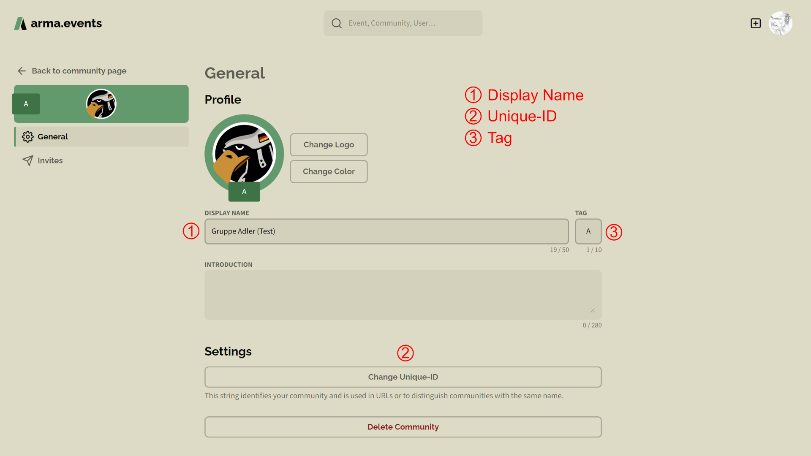
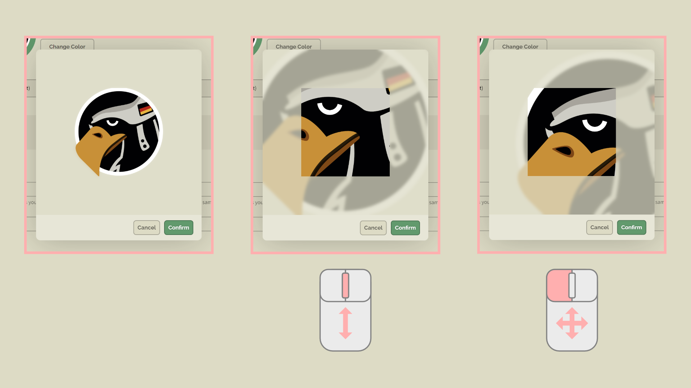

# Communities

## Create a Community

## Delete a Community

## Manage Community Settings

### Display Name vs. Unique-ID vs. Tag

Set the **display name** of your community to any string that is less or equal 50 unicode characters. The display name is the one that is displayed on **arma.events** most of the time. You can share the same display name with other communities.

The **unique-ID** is a string with 32 or less web-safe characters that has to be unique on our platform. The availability of the unique-ID is checked every time you try to change it. The unique-ID is mostly used in URLs. In all other cases the display name is shown.

The **tag** of your community is a string that is 10 or less characters long. ***TO CLARIFY: Current use of the tag is unclear. Perhaps the tag will be used as a prefix on users's display names in events mit multiple communities with format `[TAG] user display name`. I'm not sure.***

### Logo and Color

## Invite Members

## Remove Members

## Manage Admin Rights
