# Communities

## Create a Community

You can create your own community at any time by pressing the `+` symbol next to your profile avatar and selecting **Create Community**.

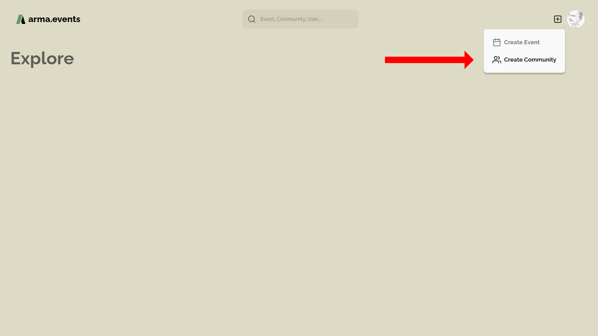

Creating a community is done in four simple steps. Everything you setup here can be changed later.

First choose a display name and a tag for your community. The name should contain 50 or less unicode characters. The tag is limited to 10 characters. The display name is used most of the time to identify your community.

Next step is to set the logo of your community. The perfect size is 256x256 pixel but if you want to zoom in then you should use an image with higher resolution. See [Logo](#logo) for more information about logo modifications.

Now you choose the base color of the community. Parts of your logo that were left blank will be filled with this color. It is also used on various other places like the community profile page.

The last step is to setup/confirm the unique ID of your community. This is a max. 32 web-friendly characters long string that is mostly used in URLs. Keep it short and easy. Because this string needs to be unique we will tell you if it is already used by another community.

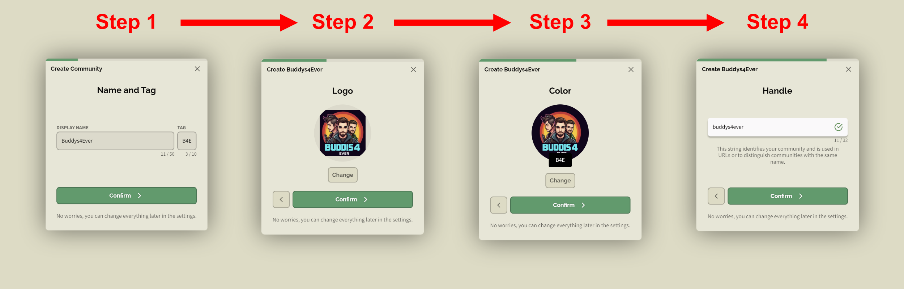

Finally, you will be redirected to the profile page of your community. Here you can change everything, add an introduction and manage your community. An invitation link is automatically created for you to share with your community members. See [Invite Members](#invite-members) for more information about player invitations.

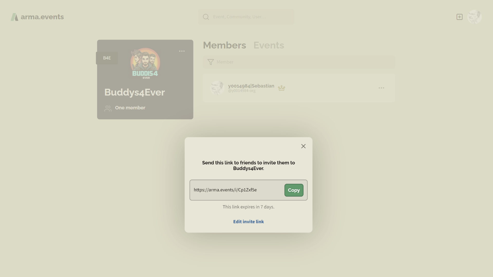

## Invite Members

Players can join your community only with a valid invitation. An inviation is a link combined with an expiration time and a max number of uses. By default the invitation is valid for 7 days and with an unlimited number of uses. You can change these settings by pressing **Edit invite link**.

The format will be always `https://arma.events/[INVITE-CODE]` like for example `https://arma.events/1YOtETcO`

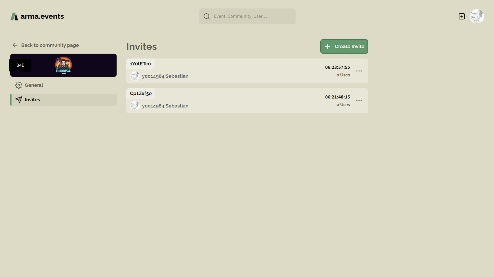

The remaining time and the number of uses is reported in the invites overview. You can open a platform dependent **share** menu or delete an active invitation via the three dots symbol. Send the created link to your designated members via your prefered sharing method.

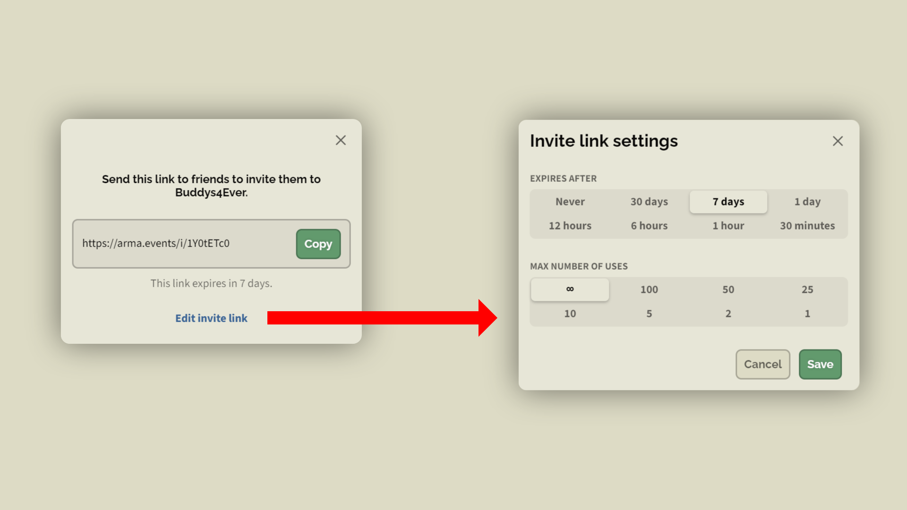

The recipient only needs to open the URL, use the Steam SSO to login and accept the invite.

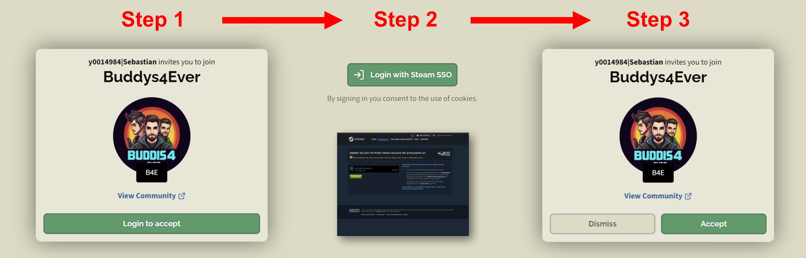

## Delete a Community

You can simply delete your community by hitting the the **Delete Community** button in the settings of your community. You will get a warning before the deletion will take affect. Keep these consequences in mind:

- Membership for all members will be revoked.
- Events of this community will be deleted.
- Invites for this community will be cancelled.
- Slots reserved for this community will be opened.

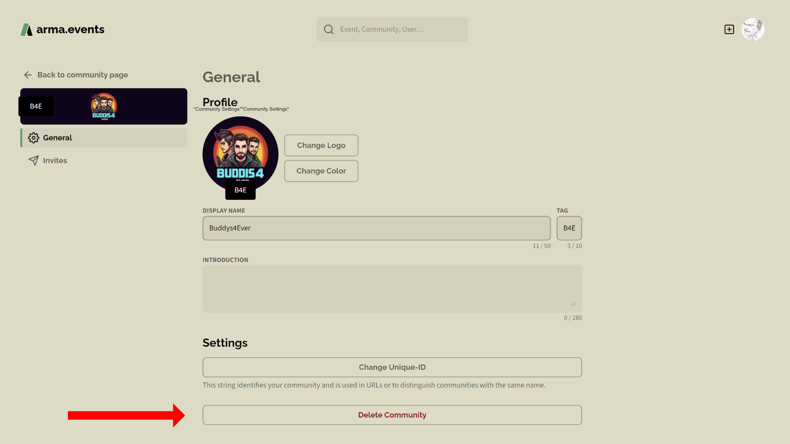

## Edit Community Settings

You can access your communites by chossing **Communities** from your avatar menu.

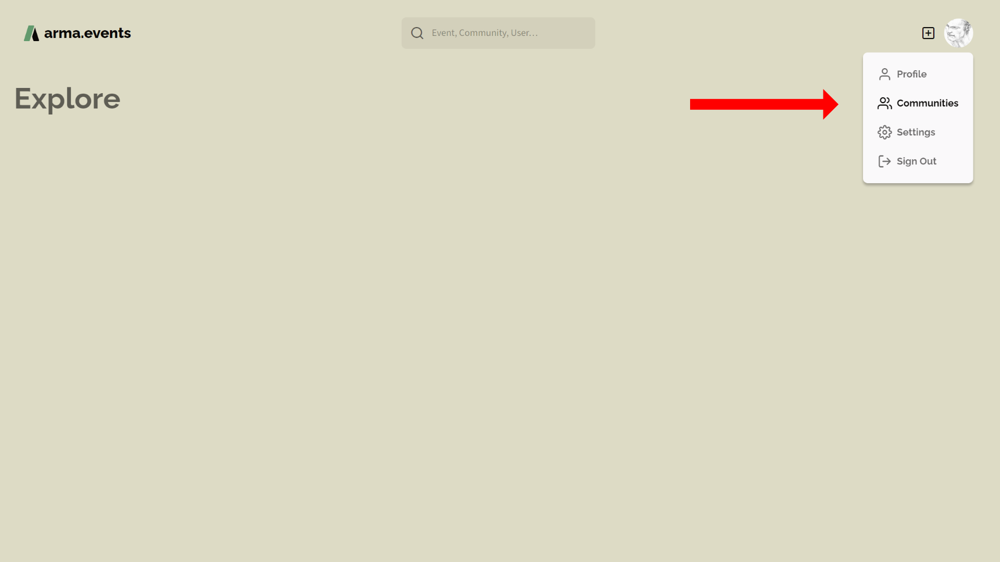

You will be redirected to the communities list in your user profile. Here you can select the community you want to manage.

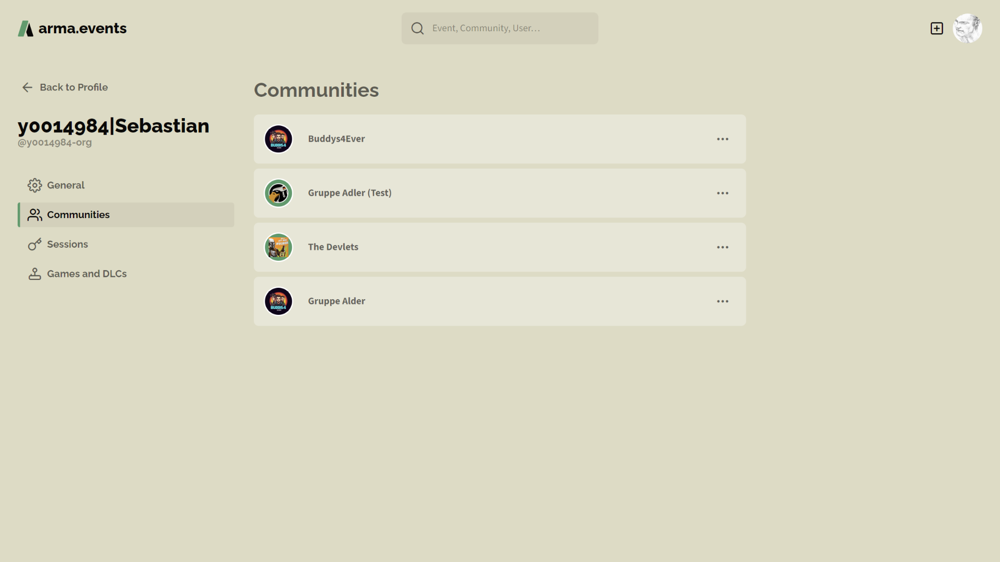

On the community profile page you can search/manage members, see events and manage the community.

> [!IMPORTANT]
> You need admin rights to manage members, events and community settings.

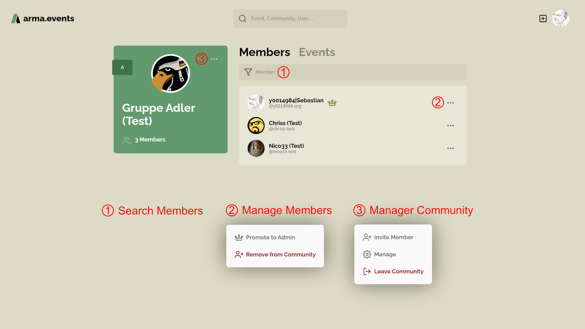

### Members

In the members tab you can search for members in the members list (1), grant admin rights to a member or remove a member from the community (2). Only admins can remove members or other admins. Only admins can promote members to admins. If you create a community you are automatically the first admin. Every admin has a crown symbol right next to his name. See [Roles](#roles) for more information.

### Roles

| Role       | Desciption |
| ----       | ---------- |
| Everybody  | Basic role for all **arma-events** users. Everybody (non-members) can see your community and user profile pages and events if set to visible. |
| Guest      | Guests (single users or whole communities) can join events. Needs to be configured in event settings. |
| Member     | Basic role for all members of a community. Members can create events, join events and leave the community. |
| Author     | If you created an event or have been invited for co-authoring then you can manage these specific event |
| Admin      | (Crown Symbol) Admins can delete the community, change community settings, remove members and admins from community, manage all community events (authored by every member), manage community invitations and grant or revoke admin rights |

### Events

In the events tab you get lists of your past and upcoming community events for direct access.

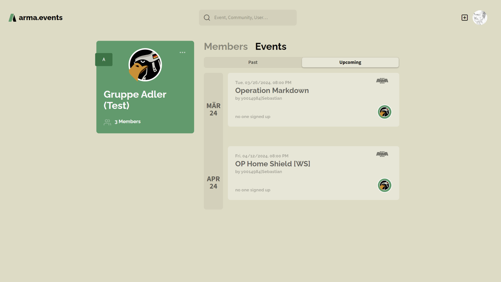

### Naming

Set the **display name** of your community to any string that is less or equal 50 unicode characters. The display name is the one that is displayed on **arma.events** most of the time. You can share the same display name with other communities.

The **unique-ID** is a string with 32 or less web-safe characters that has to be unique on our platform. The availability of the unique-ID is checked every time you try to change it. The unique-ID is mostly used in URLs. In all other cases the display name is shown.

The **tag** of your community is a string that is 10 or less characters long. It's currently not used but will be in the future.

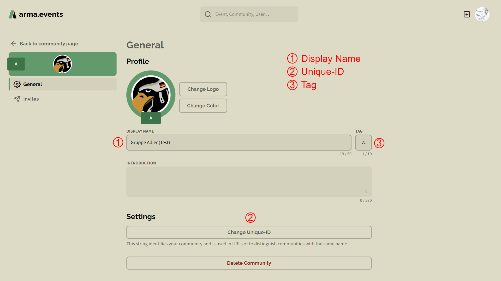

### Description

The community description is a 280 characters long text field. Use it to describe your community to non-members who visit your community page on **arma.events**.

### Logo

Various image file formats are supported. You can zoom into your image with the **scroll wheel** of your mouse and move the image while holding your **left mouse button**. The logo is always displayed in a circle. We store your image with a resolution of 256x256 pixels. Using a very low-res image or zooming in can lead to a blurry image.

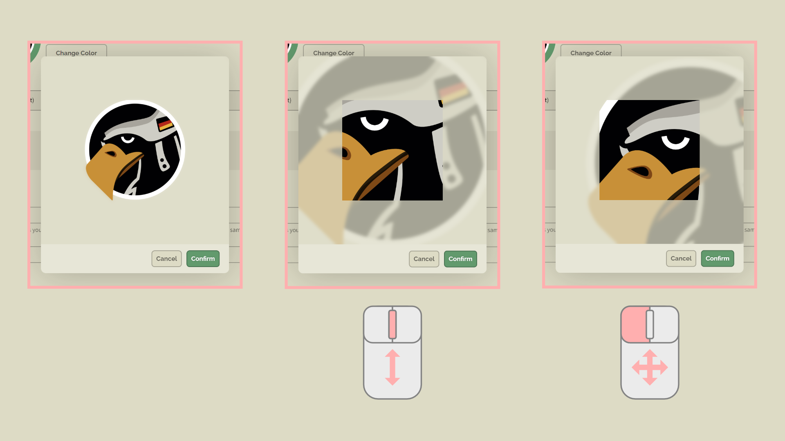

### Color

You can define a base color for your community. It is used in variuos cases as a background color like for events without an image or on the community profile page. A modified version of your background color with a higher text contrast is created as a background for the community tag. Light colors will get lighter and dark colors will get darker. Also the saturation increases. Keep that in mind and choose a background color that fits best your needs.

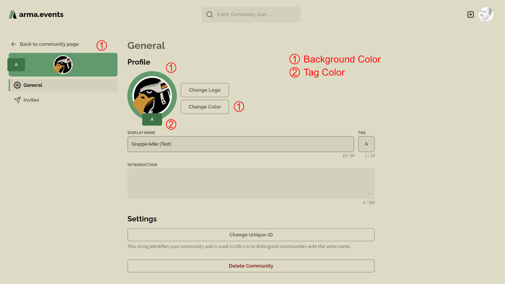
