# Communities

## Community erstellen

Du kannst jederzeit deine eigene Community erstellen indem du auf das `+` Symbol neben deinem Profil-Avatar klickst und **Community erstellen** auswählst.

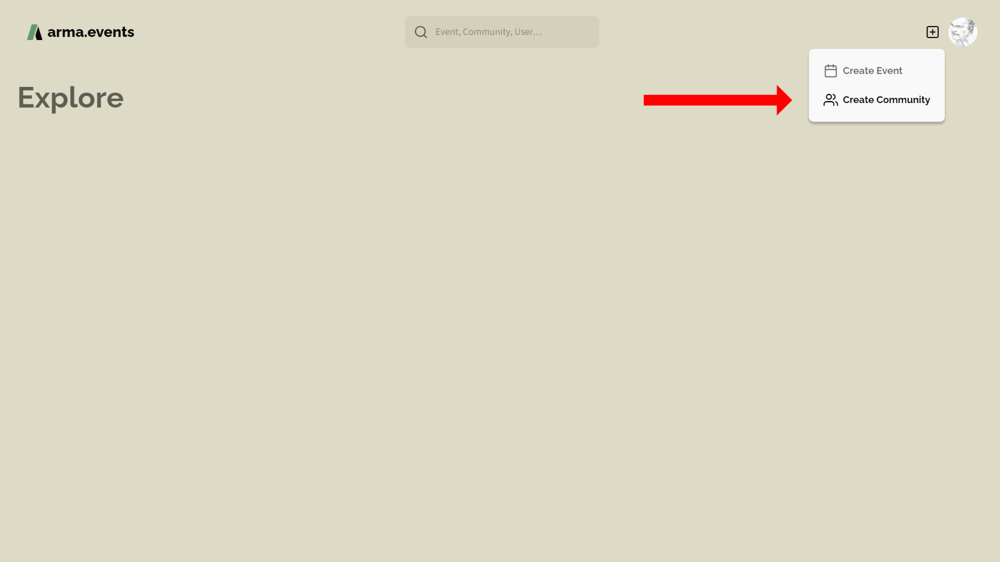

Eine Community erstellst du in vier einfachen Schritten. Alles, was du hier einstellst, kann später geändert werden.

Zuerst wähle einen Anzeigenamen und ein Clan-Tag für deine Community. Der Name sollte 50 oder weniger Unicode-Zeichen enthalten. Das Clan-Tag ist auf 10 Zeichen limitiert. In der Regel wird der Anzeigename verwendet um deine Community zu identifizieren.

Der nächste Schritt ist das Erstellen des Logos deiner Community. Die ideale Größe beträgt 256x256 Pixel aber falls du hineinzoomen möchtest dann solltest du ein höher aufgelöstes Bild verwenden. Siehe [Logo](#logo) für weitere Informationen zur Anpassung deines Logos.

Nun kannst du die Grundfarbe deiner Community wählen. Transparente Teile deines Logos werden mit dieser Farbe gefüllt. Sie wird außerdem an verschiedenen Stellen verwendet wie z.B. als Hintergrundfarbe auf der Community-Profilseite oder als Community-Farbe um Mitglieder verschiedener Communities innerhalb einer Slotliste zu unterscheiden.

Der letzte Schritt ist das auswählen/bestätigen deines Community-Handle. Dieser ist eine aus max. 32 web-freundlichen Zeichen bestehende Zeichenkette die überwiegend in URLs verwendet wird. Halte das Handle einfach und kurz. Da diese Zeichenkette einmalig sein muss, werden wir dich informieren falls sie bereits von einer anderen Community verwendet wird.

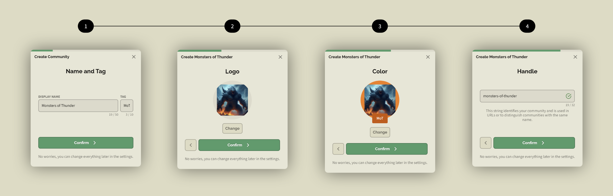

Schlussendlich wirst du auf die Profilseite deiner Community weitergeleitet. Hier kannst du alles ändern, eine Vorstellung hinzufügen und deine Community verwalten. Ein Einladungs-Link wird automatisch für dich erstellt um ihn mit deinen Community-Mitgliedern zu teilen. Siehe [Mitglieder einladen](#mitglieder-einladen) für weitere Informationen zu Mitgliedereinladungen.

> [!IMPORTANT]
> Du brauchst eine Einladung (Link) um einer Community beizutreten. Es gibt keinen anderen Weg für den Beitritt.

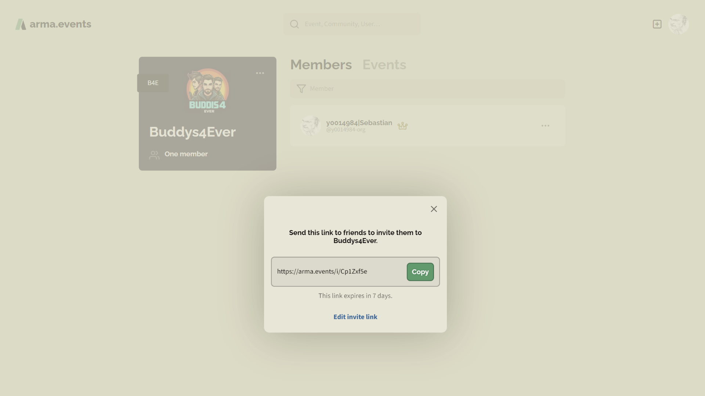

## Mitglieder einladen

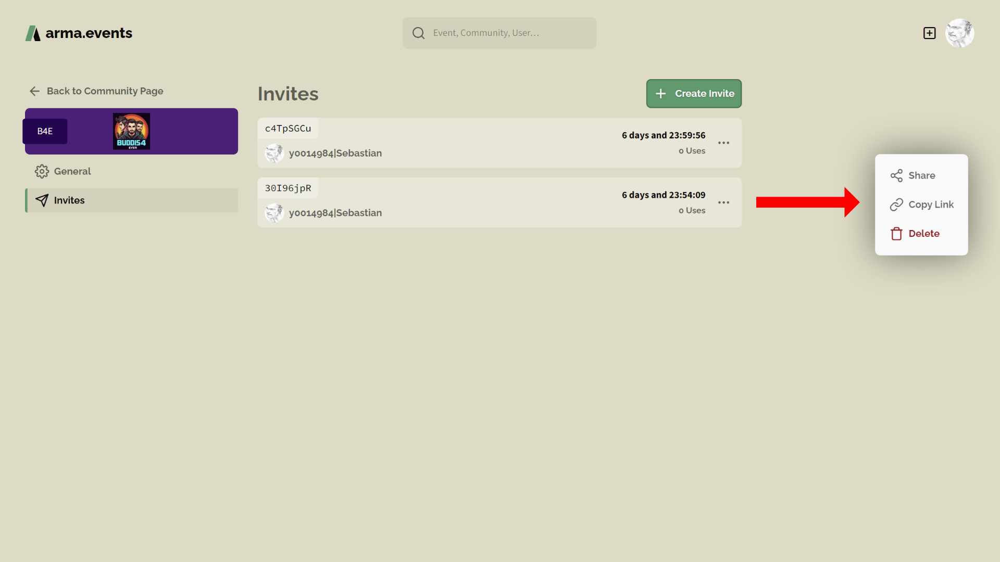

Spieler können deiner Community nur mit einer gültigen Einladung betreten. Eine Einladung ist ein Link, kombiniert mit einem Ablaufdatum und einer Höchstanzahl an Verwendungen. Standardmäßig ist eine Einladung für 7 Tage gültig und unbegrenzt nutzbar. Du kannst diese Einstellungen ändern durch klicken auf **Einladungs-Link bearbeiten** in dem Fenster das erscheint wenn du auf **+ Einladung erstellen** klickst.

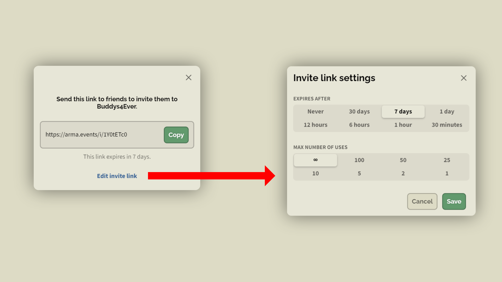

Die verbleibende Zeit und die Anzahl der Verwendungen wird in der Einladungsübersicht angezeigt. Über das Drei-Punkte-Symbol kannst du das plattformabhängige **Teilen**-Menü öffnen, eine aktive Einladung **löschen** oder **Link kopieren** benutzen. Außerdem kannst du den Link schnell kopieren indem du auf den Einladungs-Code klickst.

Sende nun den erstellten Link über deine bevorzugte Methode an deine Community-Mitglieder. Das Format eines Einladungslinks ist stets `https://arma.events/[EINLADUNGS-CODE]` also z.B. `https://arma.events/1YOtETcO`

Der Empfänger muss nur die URL öffnen, sich per Steam SSO einloggen und die Einladung akzeptieren.

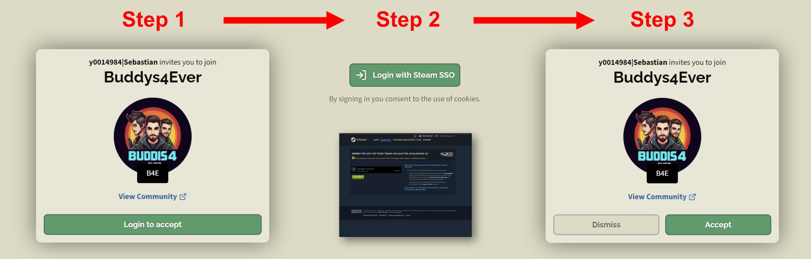

## Community löschen

Du kannst deine Community einfach löschen indem du in den Einstellungen deiner Community auf **Community löschen** klickst. Du erhältst eine Warnung bevor die Löschung durchgeführt wird. Um eine Community löschen zu können benötigst du Admin-Rechte. Beachte folgende Konsequenzen:

- Die Mitgliedschaft für alle Mitglieder wird widerrufen.
- Events dieser Community werden gelöscht.
- Einladungen für diese Community werden storniert.
- Für diese Community reservierte Slots werden geöffnet.

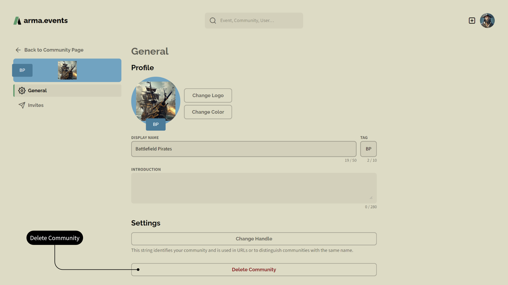

## Community-Einstellungen bearbeiten

Du kannst über den Punkt **Communities** in deinem Avatar-Menü auf die Communities, deren Mitglied du bist, zugreifen.

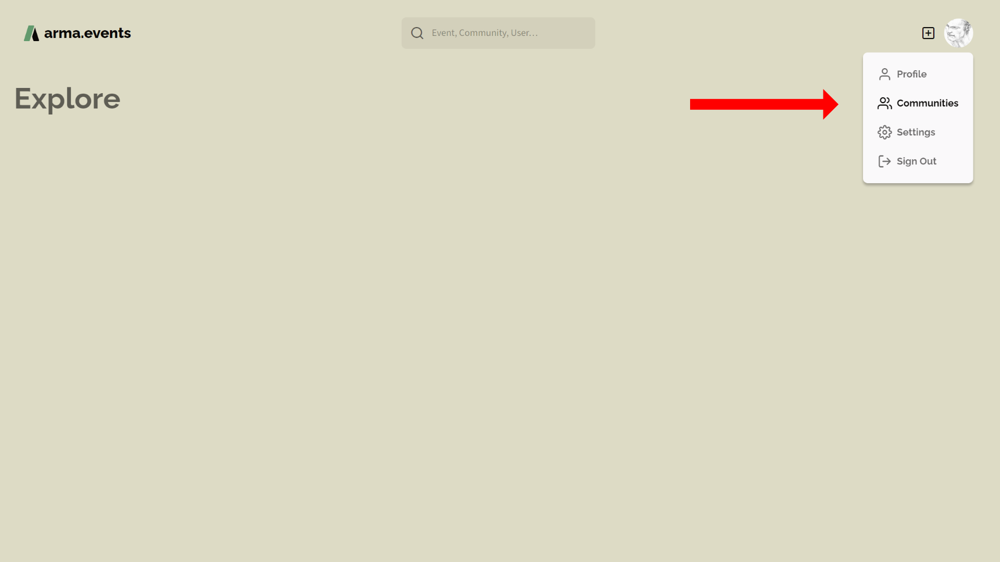

Du wirst auf die Communities-Liste in deinem Benutzerprofil weitergeleitet. Hier kannst du die Community auswählen, die du verwalten möchtest.

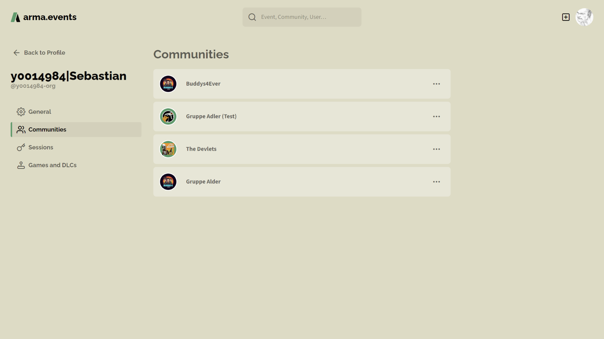

Auf der Community-Profilseite kannst du Mitglieder suchen/verwalten, Events einsehen und deine Community verwalten.

> [!IMPORTANT]
> Du benötigst Admin-Rechte um Mitglieder, Events und die Community-Einstellungen zu verwalten.

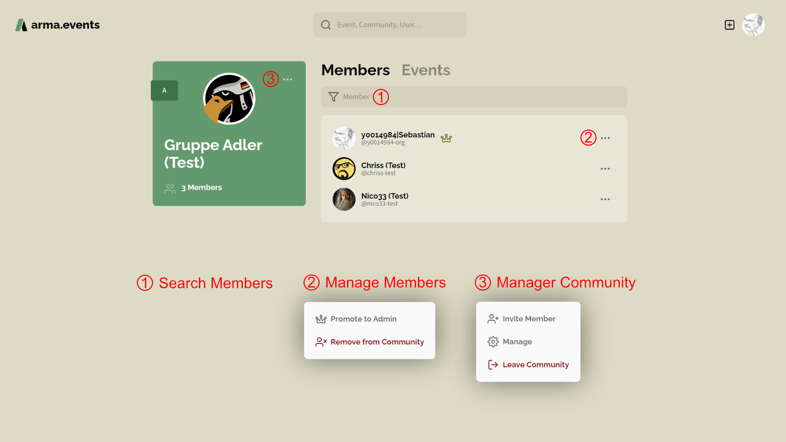

### Mitglieder

Im Mitglieder-Tab kannst du nach Mitgliedern in der Mitgliederliste suchen (1), einem Mitglied Admin-Rechte erteilen/entziehen oder ein Mitglied aus der Community entfernen (2). Nur Admins können Mitglieder oder andere Admins entfernen. Nur Admins können Mitglieder zu Admins befördern. Wenn du eine Community erstellst, wirst du automatisch der erste Admin. Jeder Admin hat ein Kronensymbol direkt neben seinem Namen. Siehe [Rollen](#rollen) für weitere Informationen.

### Rollen

| Rolle       | Beschreibung |
| -----       | ------------ |
| Jeder       | Standardrolle für alle **arma-events** Benutzer. Jeder kann deine Community- und Benutzer-Profilseiten sowie alle öffentlich einsehbaren Events sehen. |
| Gast        | Gäste (einzelne Benutzer oder ganze Communities) können Events fremder Communities per Einladung Events beitreten. Muss in den Event-Einstellungen festgelegt werden. |
| Mitglied    | Standardrolle für alle Mitglieder einer Community. Mitglieder können Events erstellen, Events beitreten und die Community verlassen. |
| Autor       | Wenn du ein Event erstellt hast, order als Co-Autor eingeladen wurdest dann kannst du dieses bestimmte Event verwalten. |
| Admin       | (Kronen-Symbol) Admins können die Community löschen, die Community-Einstellungen ändern, Mitglieder und Admins entfernen aus der Community entfernen, alle Community-Events verwalten, Community-Einladungen verwalten und Admin-Rechte gewähren oder zurückziehen. |

### Events

Im Events-Tab befindet sich eine Liste der vergangenen und anstehenden Community Events für den direkten Zugriff.

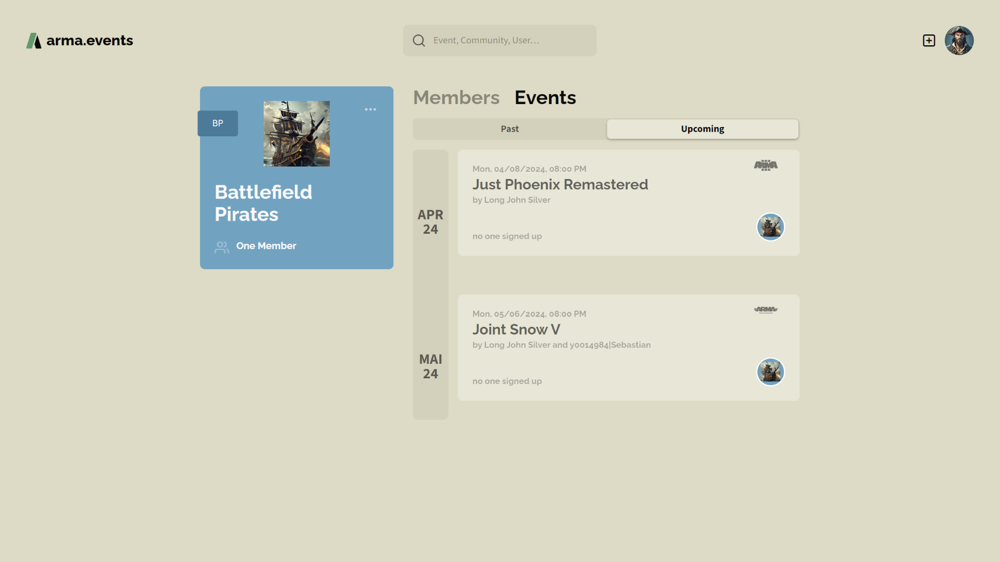

### Benennung

Lege den **Anzeigename** deiner Community auf eine beliebige Zeichenkette fest, die nicht länger als 50 Unicode-Zeichen ist. Der Anzeigename wird die meiste Zeit auf **arma.events** genutzt um deine Community zu identifizieren. Mehrere Communities können denselben Namen tragen.

Der **Handle** ist eine Zeichenkette mit 32 oder weniger web-sicheren Zeichen, die einmalig auf unserer Plattform sein müssen. Die Verfügbarkeit des Handle wird bei jeder Änderung geprüft. Der Handle wird überwiegend in URLs verwendet. In allen anderen Fällen wird der Anzeigename genutzt.

Der **Clan-Tag** deiner Community ist eine Zeichenkette mit 10 oder weniger Zeichen. Aktuell wird der Clan-Tag noch nicht verwendet aber in der Zukunft.

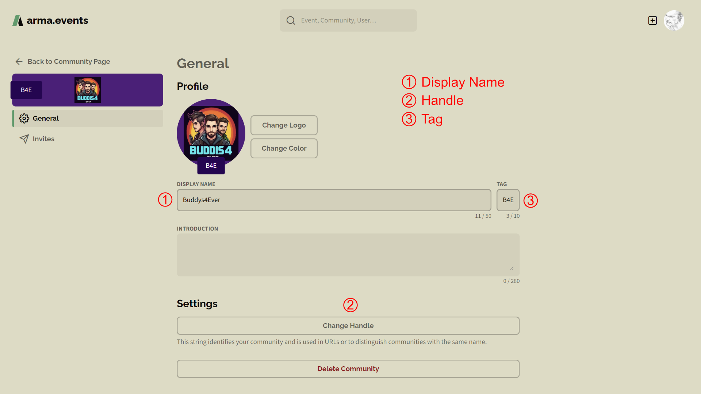

### Vorstellung

Die Community-Vorstellung ist ein 280 Zeichen umfassendes Textfeld. Nutze es um deine Community Nicht-Mitgliedern vorzustellen, die deine Community Seite auf **arma.events** besuchen.

### Logo

Verschiedene Bilddateiformate werden unterstützt. Du kannst in dein Bild mit dem **Scrollrad** deiner Maus hineinzoomen und dein Bild verschieben während du die **linke Maustaste** gedrückt hältst. Meist wird das Logo in einem Kreis dargestellt jedoch ist es auf der Community-Profilseite ein Quadrat. Wir speichern dein Bild mit einer Auflösung von 256x256 Pixeln. Die Verwendung von niedrig aufgelösten Bildern oder das Hineinzoomen kann zu einem verwaschenen Bild führen.

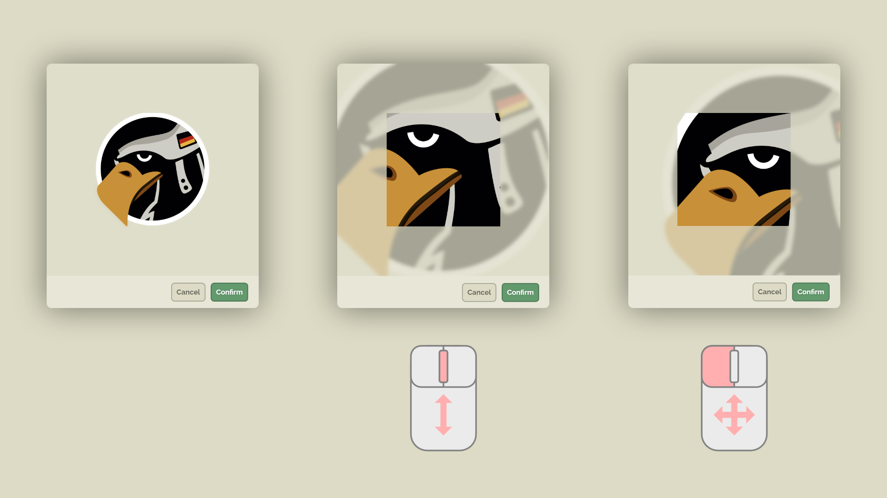

### Farbe

Du kannst eine Basisfarbe für deine Community festlegen. Sie kommt in verschiedenen Fällen als Hintergrundfarbe zum Tragen wie z.B. für Events ohne ein Hauptbild oder auf der Community-Profilseite. Eine angepasste Version der Hintergrundfarbe mit einem höheren Kontrast wird als Hintergrund für das Clan-Tag verwendet. Helle Farben werden dabei heller und dunkle Farben dunkler. Behalte dies im Hinterkopf und wähle eine Hintergrundfarbe die am Besten zu deinen Bedürfnissen passt.

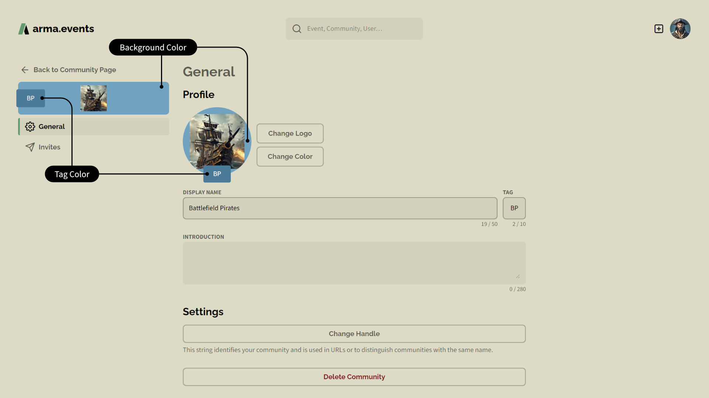
