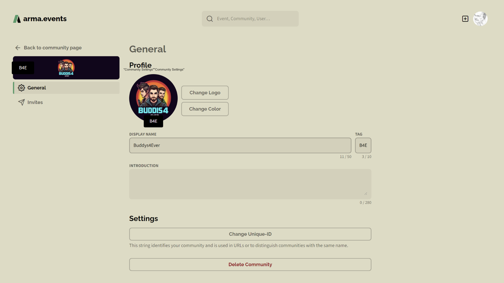

# Communities

## Create a Community

You can create your own community at any time by pressing the `+` symbol next to your profile avatar and selecting **Create Community**.

Creating a community is done in four simple steps. Everything you setup here can be changed later. 

First choose a display name and a tag for your community. The name should contain 50 or less unicode characters. The tag is limited to 10 characters. The display name is used most of the time to identify your community.

Next step is to set the logo of your community. The perfect size is 256x256 pixel but if you want to zoom in then you should use an image with higher resolution. See [Logo and Color](#logo-and-color) for more information about logo modifications.

Now you choose the base color of the community. Parts of your logo that were left blank will be filled with this color. It is also used on various other places like the community profile page.

The last step is to setup/confirm the unique ID of your community. This is a max. 32 web-friendly characters long string that is mostly used in URLs. Keep it short and easy. Because this string needs to be unique we will tell you if it is already used by another community.

Finally, you will be redirected to the profile page of your community. Here you can change everything, andd an introduction and manage your community. An invitation link is automatically created for you to share with your community members. See [Invite Members](#invite-members) for more information about player invitations.

## Delete a Community

You can simply delete your community by hitting the the **Delete Community** button in the settings of your community. You will get a warning before the deletion will take affect. Keep these consequences in mind:

- Membership for all members will be revoked.
- Events of this community will be deleted.
- Invites for this community will be cancelled.
- Slots reserved for this community will be opened.

## Manage Community Settings

### Display Name vs. Unique-ID vs. Tag

Set the **display name** of your community to any string that is less or equal 50 unicode characters. The display name is the one that is displayed on **arma.events** most of the time. You can share the same display name with other communities.

The **unique-ID** is a string with 32 or less web-safe characters that has to be unique on our platform. The availability of the unique-ID is checked every time you try to change it. The unique-ID is mostly used in URLs. In all other cases the display name is shown.

The **tag** of your community is a string that is 10 or less characters long.

### Logo and Color

Various image file formats are supported. You can zoom into your image with the **scroll wheel** of your mouse and move the image while holding your **left mouse button**. The logo is always displayed in a circle. We store your image with a resolution of 256x256 pixels. Using a very low-res image or zooming in can lead to a blurry image.

## Invite Members

Players can join your community only with a valid invitation. An inviation is a link combined with an expiration time and a max number of uses. By default the invitation is valid for 7 days and with an unlimited number of uses. You can change these settings by pressing **Edit invite link**.

The format will be always `https://arma.events/[INVITE-CODE]` like for example `https://arma.events/1YOtETcO`

The remaining time and the number of uses is reported in the invites overview. You can open a platform dependent **share** menu or delete an active invitation via the three dots symbol. Send the created link to your designated members via your prefered sharing method. 

The recipient only needs to open the URL, use the Steam SSO to login and accept the invite.

## Remove Members

## Manage Admin Rights
