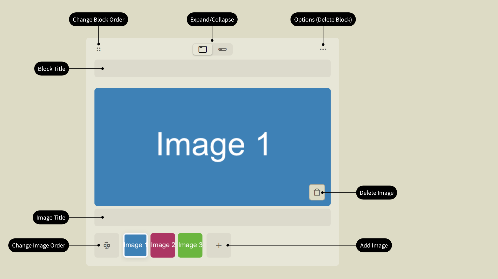

# Events

## Event erstellen

Du kannst jederzeit ein Event für deine Community erstellen indem du das `+` Symbol neben deinem Avatar anklickst und **Event erstellen** auswählst.

Ein Community-Event zu erstellen benötigt nur 4 einfache Schritte. Alles, was du hier einstellst, mit Ausnahme des gewählten Spiels, kann später geändert werden.

Wähle zuerst das Spiel aus, das in dem Event gespielt wird. Aktuell werden **Arma 3** und **Arma Reforger** unterstützt. Nach Veröffentlichung wird diese Liste auch **Arma 4** umfassen.

Wähle als nächstes die Community für dein Event. Du kannst aus einer Liste aller Communities wählen deren Mitglied du bist.

Nun wähle einen Event-Titel oder generiere einen Zufallstitel durch klicken auf das Würfel-Symbol.

> [!CAUTION]
> Die Länge des Event-Titels ist aktuell nicht beschränkt. Bitte beschränke dich auf eine Länge von weniger als 32 Unicode-Zeichen.

Der letzte Schritt ist die Auswahl von Datum und Uhrzeit, an der dein Event beginnt. Du kannst Datum und Uhrzeit manuell angeben oder den plattformabhängigen Dialog für Datum und Uhrzeit verwenden, um den Start deines Events festzulegen. Du kannst kein vergangenes Datum oder vergangene Uhrzeit wählen.

Nach Abschluss des Assistenten befindet sich dein Event im **Entwurfsstatus**. Nun kannst du die Details deines Events festlegen. Im Entwurfsstatus wird dein Event nicht gelistet oder ist irgendwo sichtbar. Nur Autoren können auf das Event zugreifen.

Du kannst jederzeit deinen Entwurf schließen durch klicken auf die `X` Schaltfläche oder dein Event veröffentlichen durch klicken auf die **Veröffentlichen** Schaltfläche. Dadurch verlässt dein Event den Entwurfsstatus und ist für alle **arma.events** Benutzer und insbesondere für deine Community und für deine Gäste sichtbar.

Speichere deine Änderungen durch klicken auf die **Entwurf speichern** Schaltfläche und schau dir deine Änderungen im Vorschaumodus an durch klicken auf die **Vorschau** Schaltfläche.

### Event-Details

Der von dir angegebene **Event-Name** (1) wurde während des Event-Erstellungsprozesses verwendet um ein **Event-Handle** (2) zu erzeugen, das auf min. 5 und max. 32 Web-freundliche Zeichen begrenzt ist. Beides kann geändert werden aber der Event-Handle muss einmalig sein. Du bekommst bei jedem Änderungsversuch ein Feedback über die Verfügbarkeit des Event-Handle.

Die **Zusammenfassung** (3) ist eine max. 280 Unicode-Zeichen lange Beschreibung deines Events. Sie wird in Übersichten verwendet ist aber in der Detailansicht deines Events nicht sichtbar.

Jedes Event kann einen oder mehrere **Autoren** (4) haben. Nur Autoren und Admins können die Event-Einstellungen ändern/verwalten. Füge weitere Autoren durch anklicken der `+` Schaltfläche hinzu oder entferne existierende Autoren, dich selbst eingeschlossen, indem du mit der Maus über den Avatar eines Autors fährst und das Mülleimer-Symbol anklickst.

Standardmäßig können nur Mitglieder deiner Community an deinem Event teilnehmen aber du kannst weitere **Communities** (5) erlauben/einladen indem du auf das Community-Ausklappmenü klickst und die Schaltfläche **Community hinzufügen** anwählst. Du erhältst ein Suchfeld um nach der einzuladenden Community zu suchen. Mitglieder einer Gast-Community können genauso wie deine eigentlichen Community-Mitglieder an dem Event teilnehmen.

Wenn das gewählte Spiel DLCs unterstützt, wie z.B. bei Arma 3, dann kannst du einige oder alle davon als verpflichtend für das Event deklarieren, indem du auf das **benötigte DLCs** Ausklappmenü klickst. Nur zahlungspflichtige DLCs werden hier gelistet. Zum Beispiel wird der Arma 3 Zeus DLC nicht aufgeführt, da er kostenlos ist.

**Datum & Uhrzeit** (7) für den Start deines Events kann im entsprechenden Ausklappmenü geändert werden. Wähle ein Datum, das in der Zukunft liegt.

Es ist eine gute Idee ein **Bild** (8) als Teaser hinzuzufügen. Lässt du das Bild leer dann wird der Bereich mit der benutzerdefinierten Hintergrundfarbe deiner Community gefüllt.

Außerdem kannst du **Tags** (9) zur Organisation deines Events hinzufügen. Zukünftig werden Tags für die Schnellsuche verwendet.

### Block-Editor

Schlussendlich erlaubt dir der Block-Editor dein Event-Briefing oder sonstige Art von Beschreibung oder Dokumentation hinzuzufügen, die du zusammen mit deinem kürzlich angelegten Event zur Verfügung stellen willst.

Erstelle Text- und Bildblöcke durch anklicken der entsprechenden Schaltflächen **Text hinzufügen** und **Bild hinzufügen**. Die Schaltflächen sind sind nur vor der Erstellung deines ersten Blocks sichtbar. Später erscheinen diese Schaltflächen wenn du mit der Maus über den Kopf- oder Fußbereich eines existierenden Blocks fährst. Du kannst so viele Blöcke erstellen wie du möchtest. Nutze das Vier-Punkte-Symbol um die Blöcke zu verschieben und ihre Reihenfolge zu ändern.

Du kannst für jeden Block entscheiden ob er standardmäßig ein- oder ausgeklappt sein soll. Auf diese Weise kannst du detailliertere Informationen verbergen und nur die wichtigsten Blöcke anzeigen. Der Nutzer kann jeden Block ein- oder ausklappen während er die Event-Dokumentation liest.

Jeder Block besteht aus einem Überschrifts- und einem Inhaltsteil. Die Benutzung der Überschrift ist optional.

#### Textblöcke

In seinem Inhaltsteil unterstützt der Textblock Markdown als Auszeichnungssprache und erlaubt damit die Verwendung von Überschriften, Listen, Links, Bildern, Textattributen und vielem mehr. Sieh dir den [Markdown](./markdown "Markdown") Artikel für weitere Informationen an.

Während der Bearbeitung ist der Textblock in seiner Größe veränderlich, jedoch wird seine Größe in der Vorschau und bei der Veröffentlichung automatisch an die Größe des Inhalts angepasst.

#### Bildblöcke

Bildblöcke erlauben dir ein oder mehrere Bilder einzubetten. Du kannst für jeden Bild separat einen Bildtitel festlegen.

> [!IMPORTANT]
> Das gleichzeitige Hochladen mehrerer Bilder wird aktuell nicht unterstützt. Lade deine Bilder einzeln hoch.

Du kannst die Reihenfolge deiner Bilder innerhalb eines Bildblocks verändern.

## Slotliste verwalten

WIP

## Event löschen

Du kannst dein Event einfach löschen indem du auf die Schaltfläche **Event löschen** klickst. Aus Sicherheitsgründen musst du deine Absicht das Event zu löschen noch einmal bestätigen.

