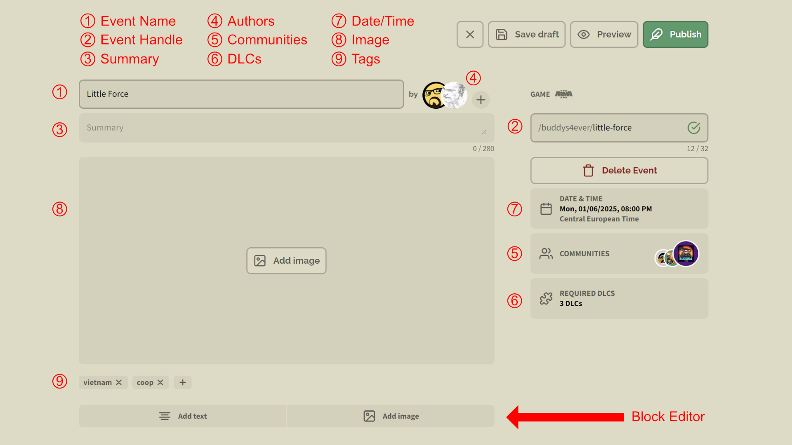

# Events

## Create Event

You can create an event for your community at any time by pressing the `+` symbol next to your profile avatar and selecting **Create Event**.

Creating a community event is done in four simple steps. Everything you setup here can be changed later except the chosen game.

First select the game that is played in the event. Currently supported are **Arma 3** and **Arma Reforger**. When released this list will be expanded to include **Arma 4**.

Next select the community for the event. You get a list of all communities you are member of to choose from.

Now choose an event title generate a title randomly by pressing the dice icon.

> [!CAUTION]
> Event title length currently not restricted. Please keep the length shorter then 32 unicode characters.

The last step is to choose a date and time for your event to start. You can setup date and time manually or use the platform dependant date and time dialog to choose the start of your event. You can't choose a date and time that is in the past.

After finishing the workflow your event is in **draft** state. Now you can setup your event details. While in draft state the event is not listed or visible anywhere. Only the authors can access the event.

### Event Details

Your given **event title** (1) is used to create an **event handle** (2) that is restricted min. 5 and max. 32 web-friendly characters. Both can be changed but the event handle needs to be unique. You get a feedback if the chosen name is available every time you change it.

The **summary** (3) is a max 280 unicode characters long description of your event. It's used in overviews but not in the detailed view of your event.

Every event can have one or more **authors** (4). Only authors and admins can change/manage the event settings. Add more authors by pressing the `+` button.

By default only members of your community can join your event but you can allow/invite more **communities** by clicking on the communities fold-out menu and hitting the **Add Community" button. You will get a search field to search for the community you want to invite.

If the chosen game supports DLCs like for example Arma 3 then you can set them as required for this event by clicking on the **DLCs** (6) fold-out menu. Here you can specify all required DLCs. Only DLCs that need to be purchased will be listed here. For example the Arma 3 Zeus DLC is not listed here because it's free.

The **date and time** (7) your event starts can be changed in the according fold-out menu.

It's a good choice to add a teaser **image** (8). If you leave the image blank then the space is filled with the custom background color of your community.

### Block Editor

Text blocks; Image blocks; order; Markdown

## Author Event

You can only author/change events that you have created yourself. If you've been added as an author to an event then you can access that event too. Admins can manage all community events.

## Delete Event

Event Details --> Button
