# Markdown

Markdown ist eine einfach Textauszeichnungssprache um formatierten Text und strukturierte Dokumente zu erstellen. **arma.events** unterstützt Markdown zur Strukturierung der Event-Texte. Die Benutzung von Markdown ist vollständig optional. Du kannst einfach deine Texte schreiben und sie durch Erstellung separater Textboxen mit Überschriften strukturieren, ohne dabei Markdown zu verwenden. Wenn du beabsichtigst Markdown zu verwenden, dann sieh dir die folgende Liste unterstützter Textauszeichnungen an.

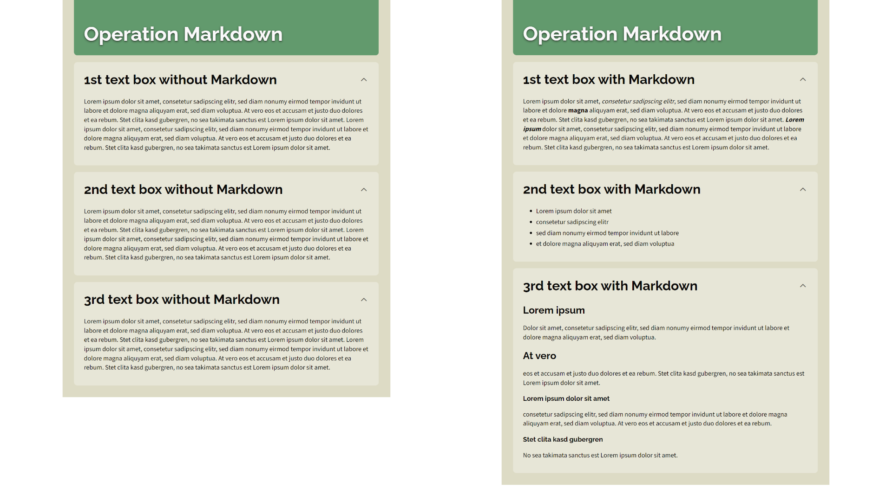

## Absätze und Zeilenumbrüche

Jedes Return in deinem Text erzeugt einen manuellen Zeilenumbruch. Jede leere Zeile erzeugt einen neuen Absatz.

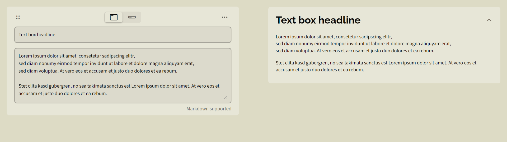

## Überschriften

Mit der #-basierenden Schreibweise kannst du bis zu 4 Abstufungen für Überschriften erzeugen. Mit `=====` und `-----` lassen sich nur 2 Abstufungen erzeugen.

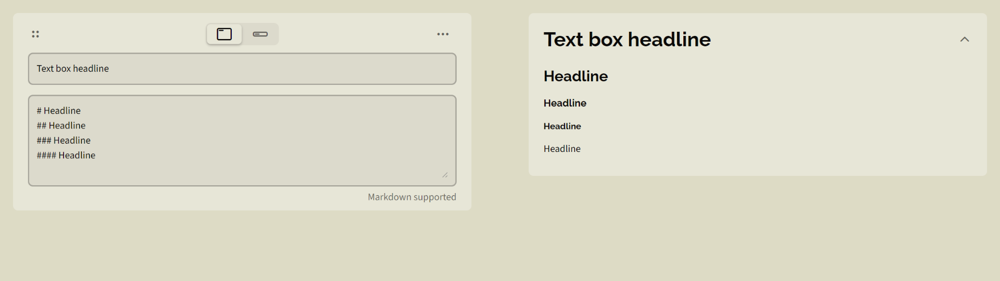

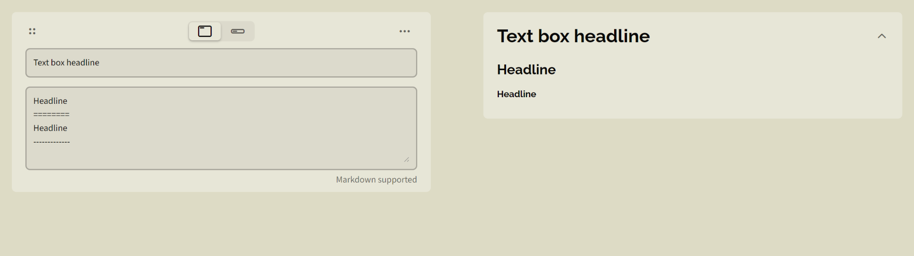

## Textauszeichnungen

\**kursiv*\* or \kursiv\_ (Alternative Schreibweise)

\*\***fett**\*\* or \_\___fett__\_\_ (Alternative Schreibweise)

\*\*\****fett kursiv***\*\*\* oder \_\_\____fett kursiv___\_\_\_ (Alternative Schreibweise)

\``Nichtproportional`\`

\~\~~~durchgestrichen~~\~\~

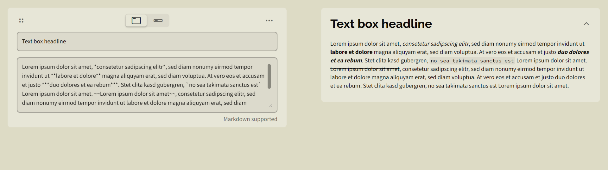

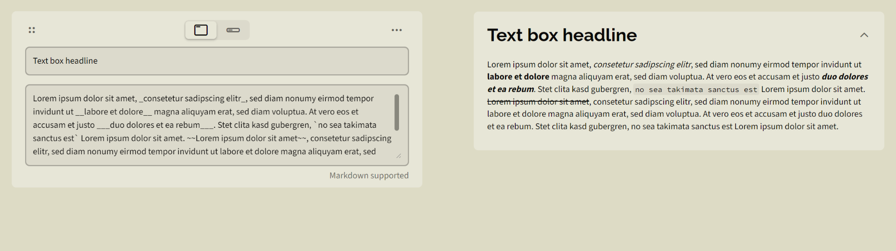

## Horizontale Linie

Mit drei Strichen `---` kannst du eine horizontale Linie erzeugen. Um Formatierungsprobleme zu vermeiden, setze eine Leerzeile über und unter der horizontalen Linie.

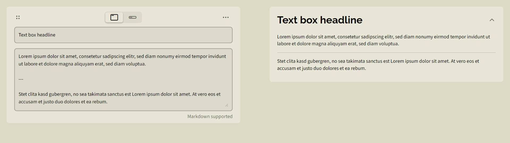

## Unsortierte Listen

Füge zwei Leerzeichen vor deinem Listenelement ein um es einzurücken. Du kannst  `-`,`+` oder `*` als Listensymbol verwenden.

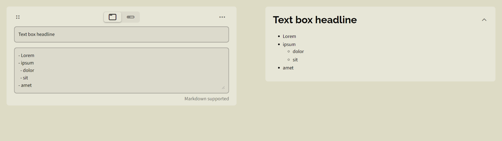

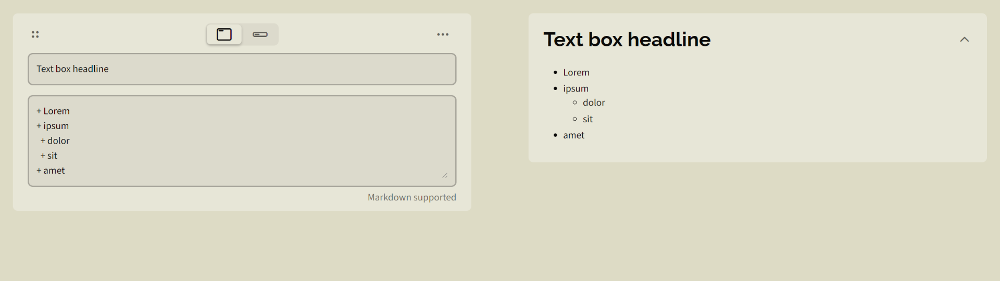


## Sortierte Listen

Füge zwei Leerzeichen vor deinem Listenelement ein um es einzurücken.


## Links

Format `[VERLINKTER TEXT] (URL "MOUSEOVER-TEXT")`

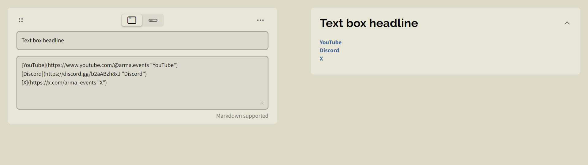

## Bilder

Format `![ALTERNATIVER TEXT] (URL "MOUSEOVER-TEXT")`

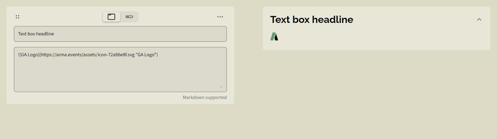

## Autolinks and E-Mail-Adressen

Umschließe deine URL or E-Mail-Adresse mit `<` und `>` um einen automatischen Link mit dem URI als Link-Text zu erzeugen.

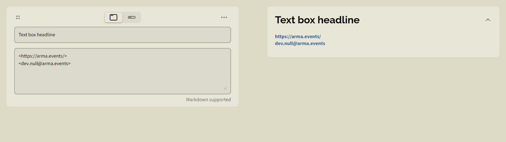

## Code-Block

Beginne jede Zeile mit ` ` 4 Leerzeichen um einen Code-Block zu erzeugen. Alternativ umschließe den Text mit ` ``` ` um einen Code-Block zu erzeugen. Syntax-Highlighting wird nicht unterstützt.

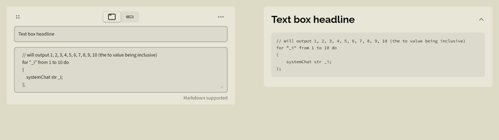

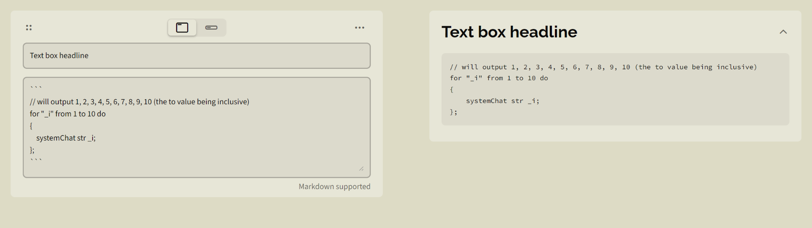

## Zitat-Block

Beginne jede Zeile or deinen Absatz mit `>` und einem ` ` Leerzeichen um einen Zitat-Block zu erstellen.

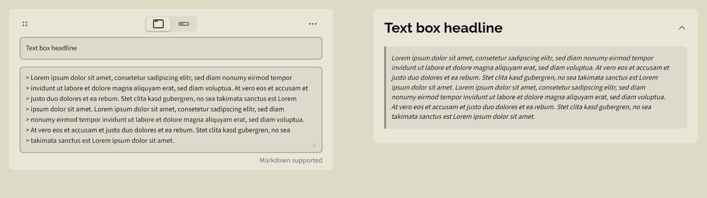

## Warnungen

Markdown Warnungen werden wie Zitat-Blöcke erzeugt, jedoch enthält die erste Zeile ein Schlüsselwort wie `[!NOTE]` oder `[!WARNING]`.

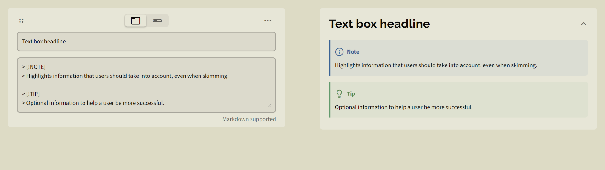

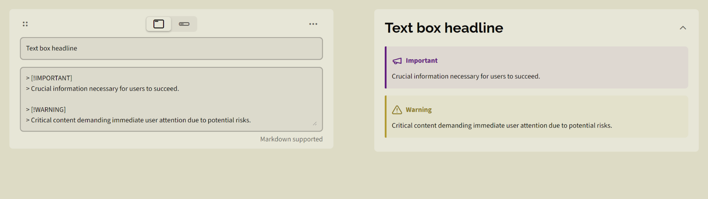

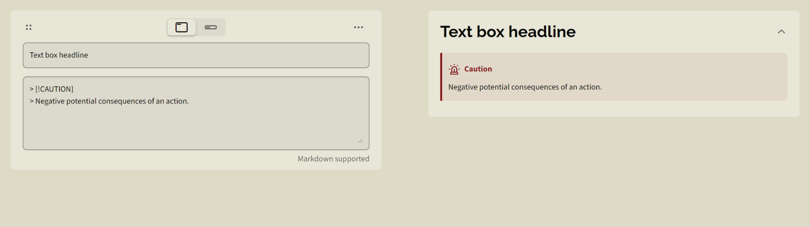

## Markdown Zeichen maskieren

Wenn du Markdown Zeichen wie normalen Text behandelt wissen möchtest dann musst du diese Zeichen mit dem `\` Prefix maskieren.

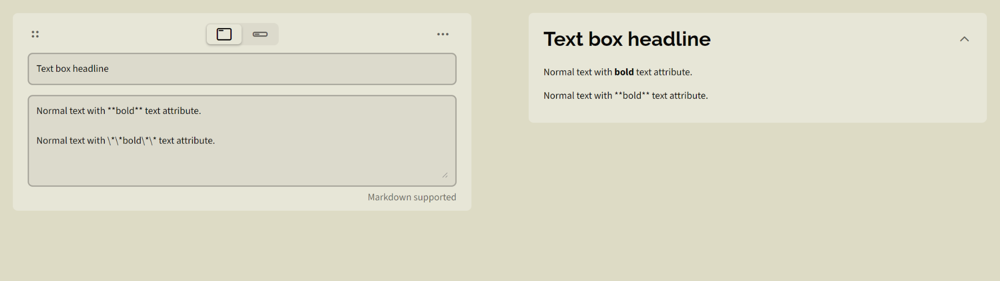
