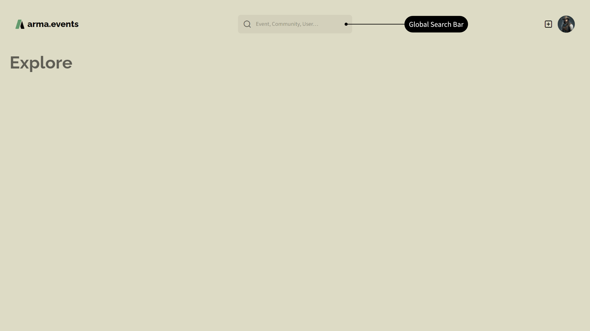
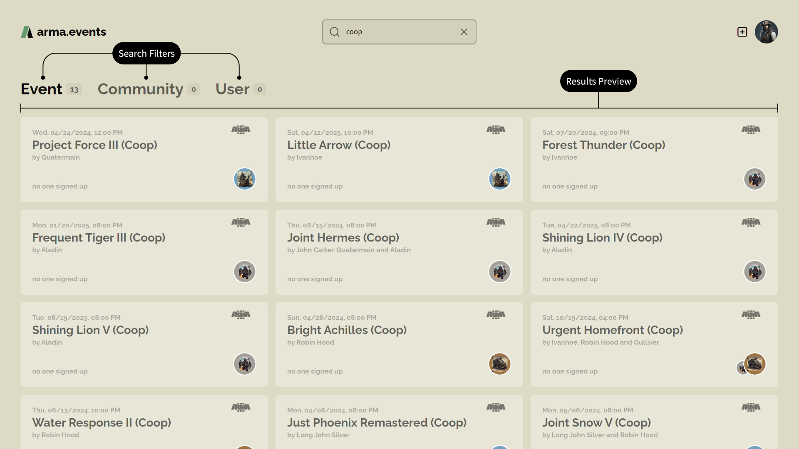
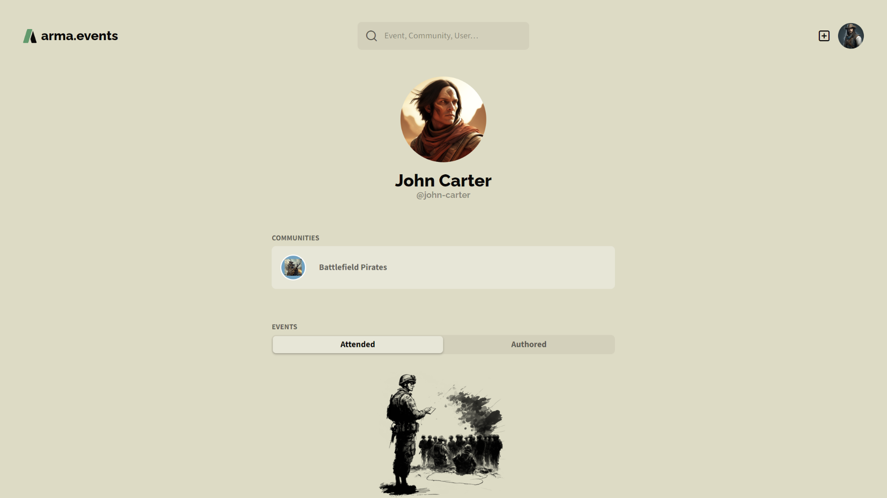

# Überblick

## Globale Suchleiste

Auf unsere globale Suchleiste kann auf jeder Seite ganz oben zugegriffen werden. Darin kannst du nach Events, Communities und Benutzern suchen.

Während des Tippens erhältst du schnelle Suchergebnisse. Du kannst diese Ergebnisse direkt **filtern** (1), auf die **Ergebnisse** (2) zugreifen oder dir die **vollständige Suchergebnisseite** (3) anzeigen lassen.

Die vollständige Suchergebnisseite erlaubt dir Zugriff auf **alle Suchergebnisse** (2) und erlaubt dir zudem die **Filterung** (1) der Ergebnisse für Events, Communities und Benutzer. Diese Ergebnisse haben eine detailliertere Vorschau als die schnellen Suchergebnisse. Klicke auf ein Suchergebnis um direkt zur entsprechenden Seite zu gelangen.

## Benutzerprofilseiten

Jeder Benutzer hat eine global sichtbare Profilseite, die den Avatar, den Anzeigenamen und den Handle des Nutzers sowie eine Liste der Communities, deren Mitglied der Benutzer ist, und eine Liste der Events, an deren der Benutzer teilgenommen hat oder von denen er Autor war, enthält. You kannst direkt auf die Communities oder Events über diese Listen zugreifen. Siehe [Benutzer](./users "Benutzer") für weitere Details.

## Community-Profilseite

Jede Community hat eine global sichtbare Profilseite, die das Logo, den Namen, das Clan-Tag, die Mitgliederanzahl und eine Vorstellung sowie eine durchsuchbare Liste aller Mitglieder (inklusive Avatar, Name, Handle und einem Kronensymbol falls das Mitglied ein Administrator dieser Community ist) und Listen der vergangenen und zukünftigen Events enthält. Du kannst direkt auf die Benutzer (WIP) oder Events über diese Listen Zugreifen. Siehe [Communities](./communities "Communities") für weitere Details.

## Event-Seiten

Jedes Event, falls es nicht auf privat gesetzt wurde, hat eine global sichtbare Profilseite, die den Namen, das Teaser-Bild, Startdatum und Uhrzeit, die gastgebende Community und Gast-Communities, eine Liste der Autoren, das Spiel und die benötigten DLCs, Tags, die Slotliste (WIP) und möglicherweise mehrere Text- und Bildboxen enthält, die das Event-Briefing darstellen. Siehe [events](./events "Events") für weitere Details.

