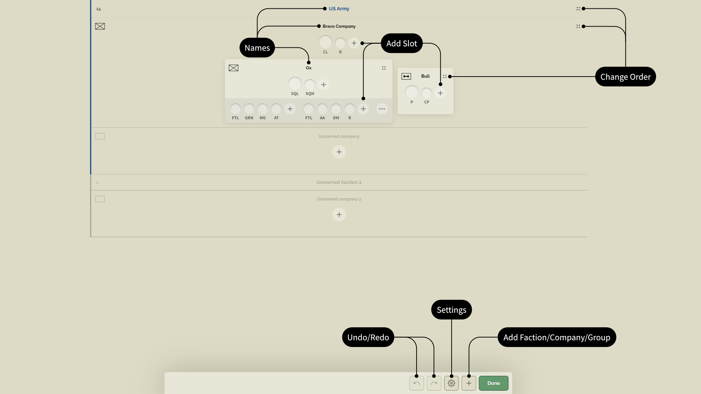

# Slotlist

Jede neue Slotliste beginnt mit einer Fraktion und einer darin enthaltenen Kompanie. Dies ist das benötige Minimum. Solang du keinen Namen für die Dummy-Fraktion oder die Dummy-Kompanie vergibst werden sie in der Slotliste versteckt. Du kannst die Dummy-Fraktion und die Dummy-Kompanie nicht verschieben. Sie sind stets die letzten Elemente. Die Dummy-Fraktion und die Dummy-Kompanie werden durch eine graue Überschrift gekennzeichnet. Alle anderen Fraktionen und Kompanien sind lösch- und verschiebbar.

Jede Änderung innerhalb des Slotlist-Editors lässt sich **rückgängig machen oder wiederherstellen**. Die Historie hat ein Limit von 20 Schritten. Du kannst **weitere Fraktionen, Kompanien und Gruppen hinzufügen** durch anklicken der `+` Schaltfläche. Du kannst bei Fraktionen, Kompanien innerhalb von Fraktionen, Gruppen innerhalb von Kompanien und Gruppen innerhalb von Gruppen die **Reihefolge ändern** indem du den Vier-Punkte-Anfasser verwendest. Solang die **Namen** nicht gesetzt sind (graue Überschrift), bleiben sie in der endgültigen Slotliste versteckt. Jede runde `+` Schaltfläche in der Slotliste zeigt eine Position an, wo **Spieler-Slots** hinzugefügt werden können.

## Organisationseinheiten

| OU        | Elternelement               | Kindelemente     | Slots | Eigenschaften   | Charakteristiken |
| ---       | ------                      | --------         | ----- | ----------      | --------------- |
| Fraktion* | keins                       | Kompanie         | nein  | Farbe, Name     | Parteien, die Teil des Konflikts sind, wie OPFOR, BLUFOR, Independant |
| Kompanie* | Fraktion                    | Gruppe oder Slot | ja    | Name, Symbol    | Höchste Organisationseinheit innerhalb einer Fraktion; kann Kompanie, Zug, Gruppe, Trupp oder Sonstiges sein |
| Gruppe**  | Kompanie oder Gruppe        | Gruppe oder Slot | ja    | Name, Symbol    | Kleinere/Mittlere Organisationseinheit; kann weitere Gruppen beinhalten; kann Zug, Gruppe, Trupp oder Sonstiges sein |
| Trupp     | Gruppe                      | Slot             | ja    | keine           | Kleinste Organisationseinheit |
| Slot      | Kompanie, Gruppe oder Trupp | keine            | nein  | Name            | Der Slot des Spielers |

\**Es gibt stets eine Dummy-Fraktion und eine Dummy-Kompanie*

\*\**Zur deutschen Übersetzung: Gruppe meint hier nicht ausschließlich die militärische Einheit sondern ist ein Überbegriff für verschiedene Einheitstypen, einschließlich einer militärischen Gruppe, könnte also auch mit 'Einheit' übersetzt werden*

## Fraktionen, Kompanien, Gruppen erstellen

Du kannst Fraktionen, Kompanien und Gruppen durch klicken auf die quadratische `+` Schaltfläche in der unteren Menüleiste und anschließendem ziehen auf eine der durch einen grauen Balken markierten, möglichen Ablagefläche erstellen. Die aktuell aktive Ablagefläche wird größer und die Farbe ändert sich zu einem dunkleren Grau, um die aktuelle Auswahl anzuzeigen. Du kannst Gruppen innerhalb von Gruppen erstellen.

<video controls autoplay muted><source src="../videos/slotlist/create-factions-companies-groups.webm" type="video/webm">Dein Browser unterstützt das Video-Tag nicht.</video>

## Slots erstellen

Slots werden durch einmaliges oder mehrfaches Klicken auf die runde `+` Schaltfläche erzeugt. Es gibt keine natürliche Slot-Begrenzung aber organisiere dich mit deiner Slotliste, indem du nicht zu große Einheiten erstellst. Der erste Slot innerhalb einer Kompanie oder innerhalb einer Gruppe ist stets ein Führungs-Slot. Der Avatar ist größer und der Standardname ist **CL** (Company Lead = Kompanieführung) oder **SQL** (Squad Lead = Gruppenführer). Du kannst die Slot-Namen später anpassen. Der erste Slot innerhalb eines Trupps heißt **FTL** (Fireteam Lead = Truppführer) aber der Avatar wird nicht vergrößert.

<video controls autoplay muted><source src="../videos/slotlist/create-slots.webm" type="video/webm">Dein Browser unterstützt das Video-Tag nicht.</video>

## Trupps erstellen

Trupps sind ein Spezialfall bei den Einheiten. Du kannst den ersten Trupp nur innerhalb einer Gruppe durch Ziehen eines existierenden Slots auf die untere Ablagefläche erstellen. Eine Gruppe kann sich in mehrere Trupps aufteilen. Erstelle weitere Trupps durch klicken auf die Drei-Punkte-Schaltfläche.

<video controls autoplay muted><source src="../videos/slotlist/create-fireteams.webm" type="video/webm">Dein Browser unterstützt das Video-Tag nicht.</video>

## Fraktionen, Kompanien, Gruppen verschieben

Du kannst Fraktionen, Kompanien und Gruppen mithilfe des Vier-Punkte-Anfassers verschieben. Graue Ablageflächen zeigen gültige Positionen an, an die du Elemente verschieben kannst. Die aktuell ausgewählte Ablagefläche wird dunkler und größer als die nicht Ausgewählten dargestellt.

<video controls autoplay muted><source src="../videos/slotlist/move-factions-companies-groups.webm" type="video/webm">Dein Browser unterstützt das Video-Tag nicht.</video>

## Slots verschieben

Du kannst Slots per Drag-And-Drop auf die hervorgehobenen Ablagezonen verschieben. Die aktuell ausgewählte Ablagezone wird dunkler und größer als die nicht Ausgewählten dargestellt.

<video controls autoplay muted><source src="../videos/slotlist/move-slots.webm" type="video/webm">Dein Browser unterstützt das Video-Tag nicht.</video>

> [!IMPORTANT]
> Du kannst Trupps nicht verschieben. Wenn du einen Trupp verschieben willst, musst du die einzelnen Slots durchwechseln.

## Fraktionen, Kompanien, Gruppen umbenennen

WIP

## Slots umbenennen

WIP

## Fraktionen, Kompanien, Gruppen löschen

Du kannst Fraktionen, Kompanien und Gruppen per Drag-And-Drop auf das Mülleimersymbol löschen. Kindelemente werden dadurch auch gelöscht. Wenn du zum Beispiel eine Fraktion löschst, dann werden alle Kompanien und Gruppen innerhalb dieser Fraktion gleichermaßen gelöscht.

<video controls autoplay muted><source src="../videos/slotlist/delete-factions-companies-groups.webm" type="video/webm">Dein Browser unterstützt das Video-Tag nicht.</video>

## Slots löschen

WIP

> [!IMPORTANT]
> Du kannst keine Trupps löschen. Wenn du einen Trupp löschen möchtest dann musst du seine Slots löschen.
