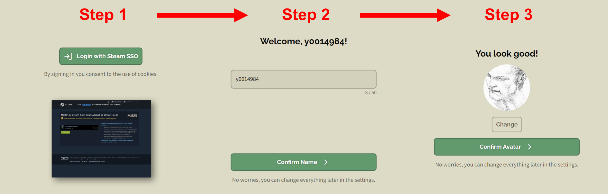
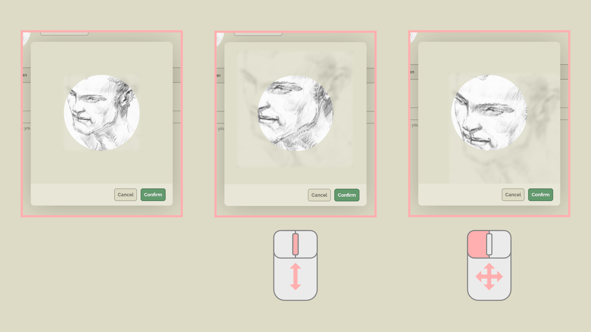
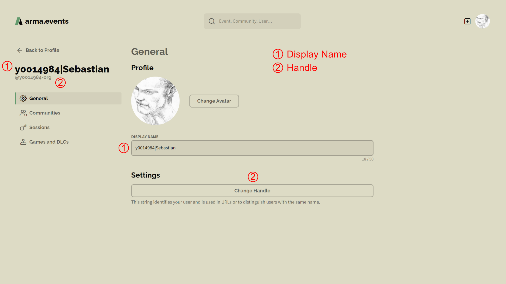
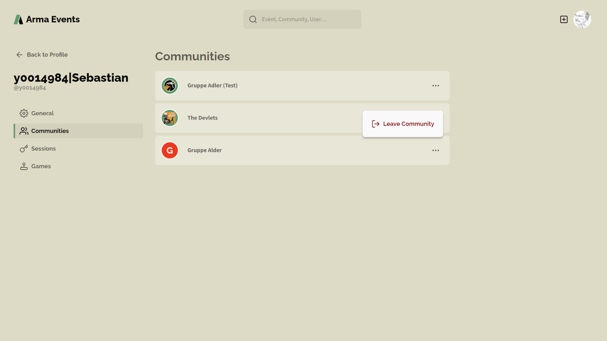
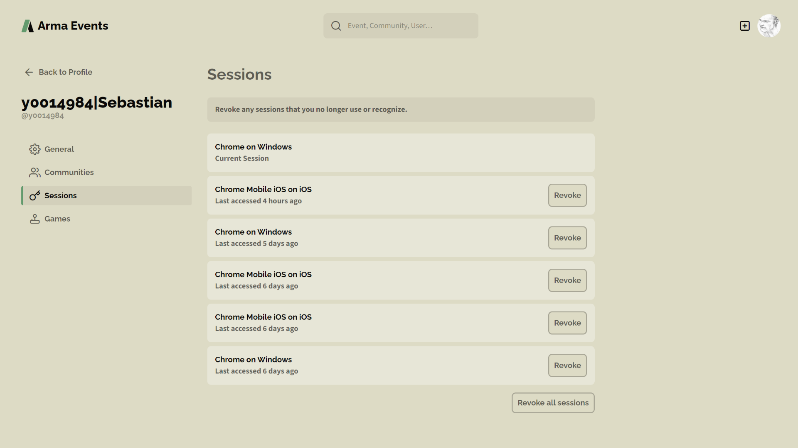
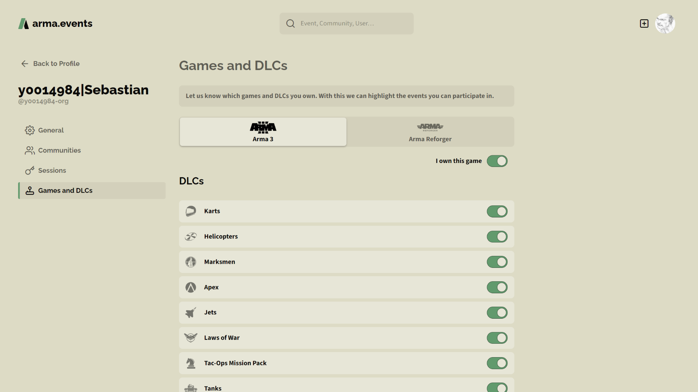

# Benutzer

## Per Steam SSO einloggen

Es ist sehr wahrscheinlich, dass jeder Spieler, der unsere Plattform nutzen möchte, einen Steam Account hat. Aus diesem Grund entschieden wir uns Accounts auf **arma.events** mit dem Steam Account des Spielers zu verknüpfen. Du musst dich nur mit deinem Steam Account einloggen. Das ist alles, was nötig ist. Aktuell gibt es keine Möglichkeit einen Account basierend auf Benutzername und Passwort zu erzeugen. Steam kümmert sich für uns um den Login-Vorgang. Wir können weder dein Passwort sehen noch auf deinen Steam Account zugreifen.

## Account erstellen

Es braucht nur drei einfache Assistent-geführte Schritte, um einen **arma.events** Benutzer-Account zu erstellen. Als Erstes log dich mit deinem bestehenden Steam Account ein. Du wirst automatisch zu Steam und wieder zurück geleitet während dieses Vorgangs. Als Zweites bestätige oder ändere deinen Anzeigenamen. Als Drittes wähle deinen Avatar oder lass ihn leer.

Das war's. Du bist nun erfolgreich bei **arma.events** mit deinem Steam Account eingeloggt. Du kannst alles später in deinen Profileinstellungen ändern. Nun kannst du deine eigene Community erstellen oder deinen Community Manager bitten dir eine Einladung für deine Community zu senden. Als Mitglied einer Community kannst du an Events dieser Community teilnehmen. Siehe [Communities](./communities "Communities") für weitere Informationen.

## Account löschen

***WIP***

## Benutzerprofil bearbeiten

### Avatar

Zahlreiche Bilddateiformate werden unterstützt. Du kannst mithilfe des **Scrollrades** deiner Maus in das Bild hineinzoomen und es bewegen während du die **linke Maustaste** gedrückt hältst. Der Avatar wird stets in einem Kreis dargestellt. Wir speichern dein Bild mit einer Auflösung von 256x256 Pixeln. Die Verwendung von niedrig aufgelösten Bildern oder das Hineinzoomen können zu einem verschwommenen Bild führen.

### Benennung

Der **Anzeigename** und der **Handle** sind meistens identisch nach dem ersten Login. Nicht erlaubte sind Zeichen werden im Handle entfernt oder ersetzt und die Länge wird begrenzt. Beide, der Anzeigename und der Handle, können später unabhängig voneinander geändert werden.

Nutze eine beliebige Zeichenkette für deinen **Anzeigenamen**, die kleiner gleich 50 Unicode-Zeichen ist. Der Anzeigename ist derjenige der die meiste Zeit auf **arma.events** zur Anzeige kommt. Mehrere Benutzer können den identischen Anzeigenamen haben.

Der **Handle** ist eine auf unserer Plattform einmalige Zeichenkette bestehend aus 32 oder weniger Web-freundlichen Zeichen. Die Verfügbarkeit des Handles wird bei jedem Änderungsversuch geprüft. Der Handle wird überwiegend in URLs genutzt. In allen sonstigen Fällen wird der Anzeigename verwendet.

### Communities

Dein Benutzerprofil enthält eine Liste aller Communities, deren Mitglied du bist. Du kannst diesen Überblick verwenden um zu einer Community zu springen oder über das Drei-Punkte-Kontextmenü Communities zu verlassen, deren Mitglied du nicht mehr sein möchtest.

Bedenke, dass die Community gelöscht wird, falls du das einzige/letzte Mitglied bist. Falls noch andere Mitglieder vorhanden sind aber du der einzige Administrator dieser Community bist, dann musst du deine Admin-Rechte vor der Löschung auf ein anderes Mitglied übertragen. Siehe [Communities](./communities "Communities") für weitere Informationen zum Community-Management.

### Sessions

Das Session-Management ist ein Sicherheits-Feature. Es listet alle aktiven Browser-Sessions auf deinen Geräten. Fühl dich frei alle Sessions, die du nicht mehr benötigst, oder alle Sessions gleichzeitig zu löschen/widerrufen. Eine widerrufene Session bedeutet, dass du dich auf der bestimmten Gerät-Browser-Kombination erneut einloggen musst.

### Spiele und DLCs

In deinem Profil kannst du definieren welche Spiele du besitzt. Aktuell unterstützt werden **Arma 3** und **Arma Reforger**. Wenn veröffentlicht wird auch **Arma 4** hinzugefügt. Kontaktiere unseren [Support](./support "Support") wenn du daran interessiert bist weitere Spiele hinzuzufügen. Falls das Spiel DLCs unterstützt dann gib bitte zusätzlich an, welche du davon besitzt.

Die in deinem Besitz befindlichen DLCs werden gegen die vom Missionsersteller für ein bestimmtes Event festgelegten DLC-Anforderungen abgeglichen. Im Falle eines fehlenden DLCs erhältst du eine Warnung.

