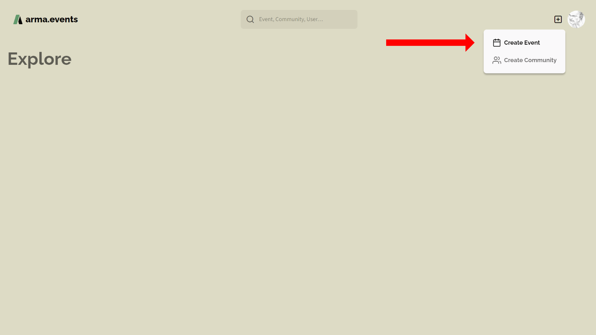
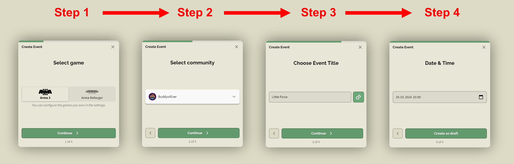
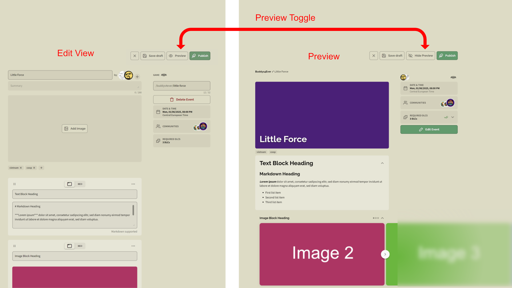
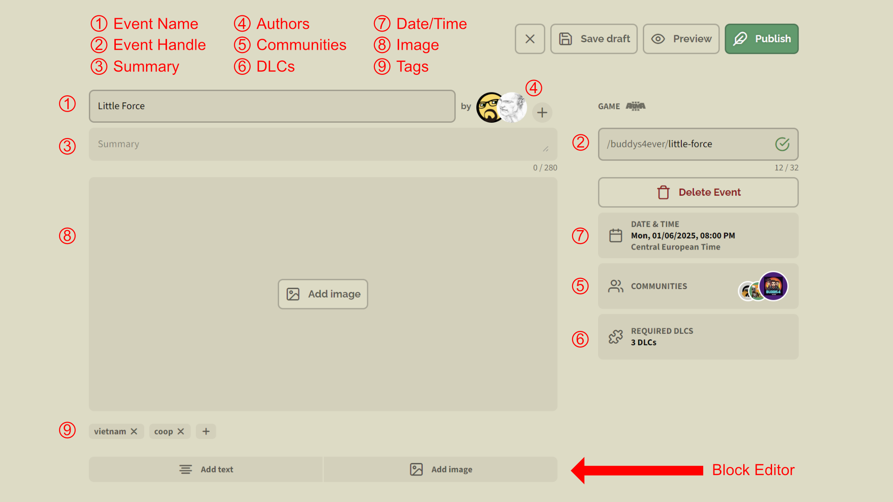
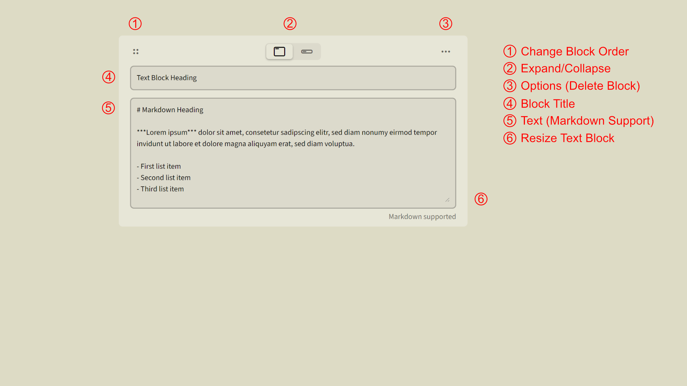
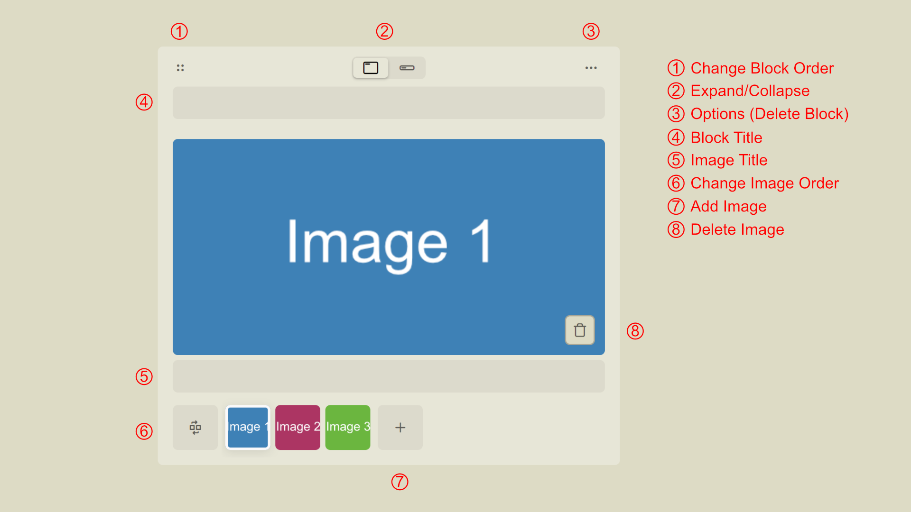
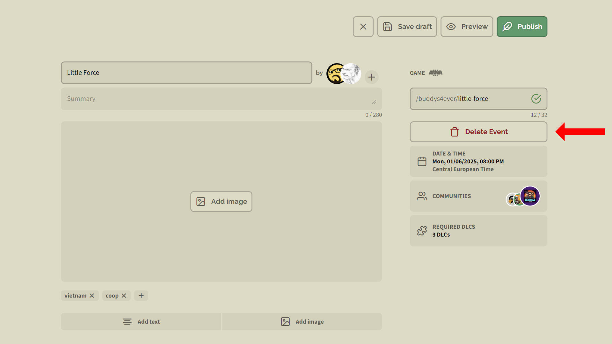

# Events

## Create Event

You can create an event for your community at any time by pressing the `+` symbol next to your profile avatar and selecting **Create Event**.

Creating a community event is done in four simple steps. Everything you setup here can be changed later except the chosen game.

First select the game that is played in the event. Currently supported is **Arma 3** and **Arma Reforger**. When released this list will be expanded to include **Arma 4**.

Next select the community for the event. You get a list of all communities you are member of to choose from.

Now choose an event title or generate a title randomly by pressing the dice icon.

> [!CAUTION]
> Event title length currently not restricted. Please keep the length shorter then 32 unicode characters.

The last step is to choose a date and time for your event to start. You can setup date and time manually or use the platform dependant date and time dialog to choose the start of your event. You can't choose a date and time that is in the past.

After finishing the workflow your event is in **draft** state. Now you can setup your event details. While in draft state the event is not listed or visible anywhere. Only the authors can access the event.

You can close your draft any time by pressing the `X` button or publish your event by pressing the **Publish** button. By that your event leaves the draft state and is visible to all **arma.events** users and especially to your community and your guests.

Save your changes by pressing the **Save Draft** button and see your changes in preview mode by pressing the **Preview** button.

### Event Details

Your given **event title** (1) was used in the event creation process to create an **event handle** (2) that is restricted to min. 5 and max. 32 web-friendly characters. Both can be changed but the event handle needs to be unique. You will get a feedback if the chosen name is available every time you try to change it.

The **summary** (3) is a max 280 unicode characters long description of your event. It's used in overviews but not in the detailed view of your event.

Every event can have one or more **authors** (4). Only authors and admins can change/manage the event settings. Add more authors by pressing the `+` button or remove existing authors including yourself by hovering with the mouse over the avatar image and pressing the trash can icon.

By default only members of your community can join your event but you can allow/invite more **communities** by clicking on the communities fold-out menu and hitting the **Add Community** button. You will get a search field to search for the community you want to invite. Guest community members can join your events like your origin community members.

If the chosen game supports DLCs like for example Arma 3 then you can set some or all of them as required for this event by clicking on the **DLCs** (6) fold-out menu. Here you can specify all required DLCs. Only DLCs that need to be purchased will be listed here. For example the Arma 3 Zeus DLC is not listed here because it's free.

The **date and time** (7) your event starts can be changed in the according fold-out menu. Choose a date that is in the future.

It's a good choice to add a teaser **image** (8). If you leave the image blank then the space is filled with the custom background color of your community.

You can also add **tags** to organize your event. In the future tags will be used as quick search terms.

### Block Editor

The Block Editor finally allows you to create your event briefing or any kind of description or documentation that you want to provide with your newly created event.

Create text blocks and image blocks by pressing the corresponding buttons **Add Text** and **Add Image**. You can create as much blocks as you want. Use the four dots symbol to move the blocks around and change their order.

For every block you can decide to collapse or expand it by default. That way you can hide more detailed information and only show the most significant blocks. The user can expand or collapse every block while reading through the event documentation.

Every block consists of a heading part and a content part. Using the heading is completely optional.

#### Text Blocks

The text block supports Markdown in it's content part which enables you to use subheadlines, lists, links, images, text attributes and many more. See the [Markdown](./markdown "Markdown") article for more information.

The Text block ist resizeable while editing but will automatically adjust it's size in preview and when published based on it's content.

#### Image Blocks

Image blocks allow you to embed one or more images. You can setup an image title for every image separately.

> [!IMPORTANT]
> Multi-Image upload is currently not supported. Upload your images separately.

You can change the order of your images inside the image block.

## Manage Slotlist

WIP

## Delete Event

You can simply delete your event by pressing the **Delete Event** button.

