# Markdown

Markdown is a plain text lightweight markup language for creating formatted text and structured documents. **arma.events** supports Markdown for structuring your event texts. Using Markdown is completely optional. You can simply write your texts and structure them by creating separate text boxes with headlines and without using Markdown at all. If you intend to use Markdown see the list of the supported text markups below.

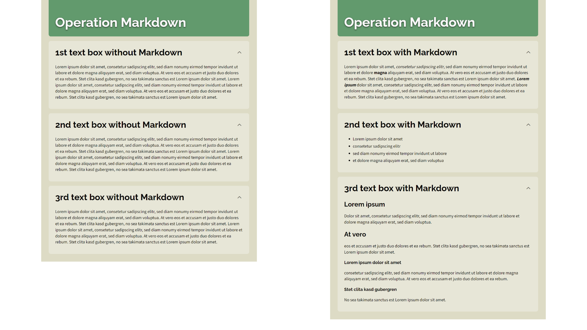

## Paragraphs and Line Breaks

Each return in your text will create a line manual break. Each blank line will create a new paragraph.

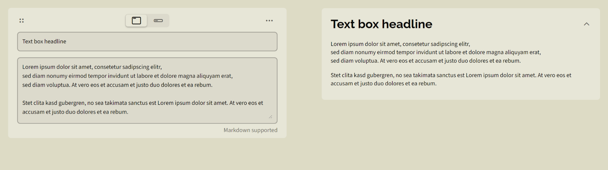

## Heading

With the #-based syntax you can create up to 4 headline hierarchies. With `=====` and `-----` you can create only 2 hierarchies.

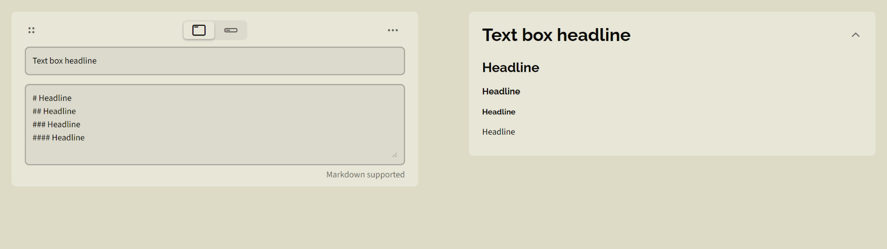

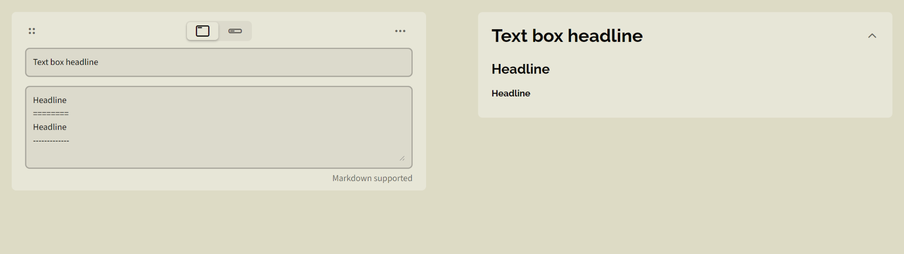

## Text Attributes

\**italic*\* or \__italic_\_ (Alternative Syntax)

\*\***bold**\*\* or \_\___bold__\_\_ (Alternative Syntax)

\*\*\****bold italic***\*\*\* or \_\_\____bold italic___\_\_\_ (Alternative Syntax)

\``monospaced`\`

\~\~~~strikethrough~~\~\~

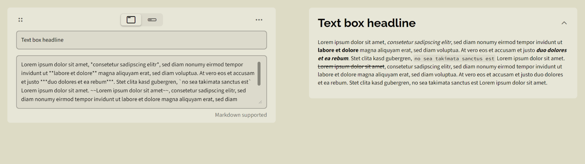

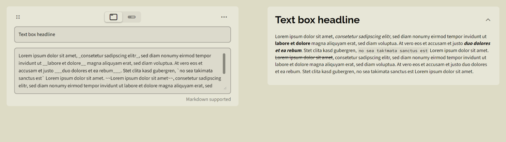

## Horizontal Rule

With three dashes `---` you can create a horizontal line. Keep a blank line before and after to prevent formatting issues.

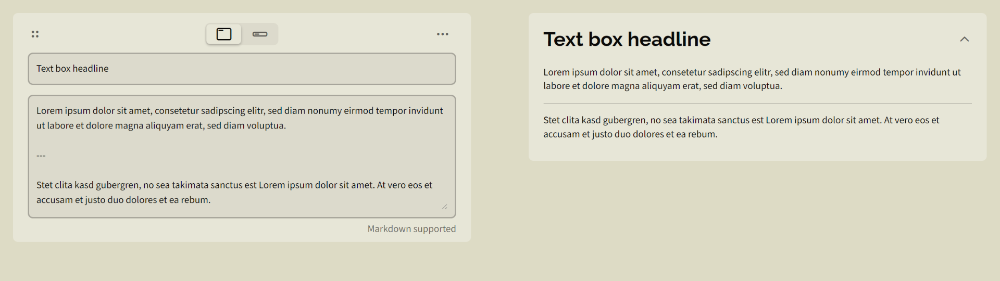

## Unsorted Lists

Add two blank spaces in front of your list item for intendation. You can use `-`,`+` or `*` as list sign.


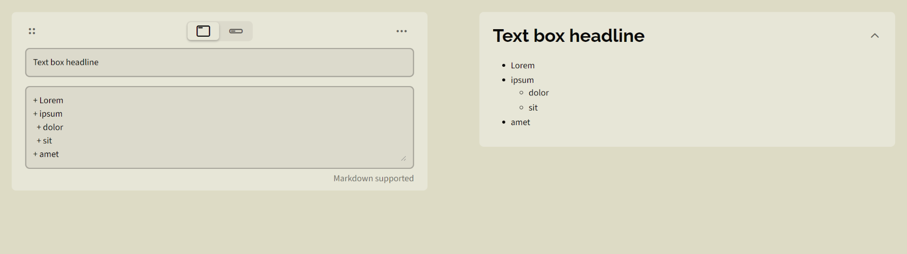

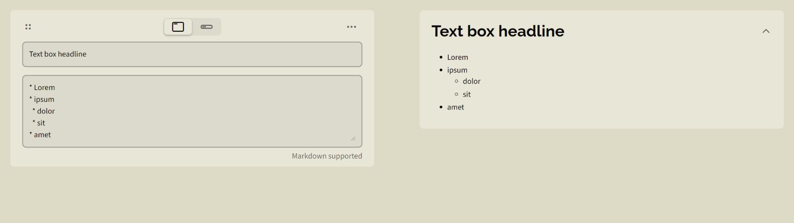

## Sorted Lists

Add two blank spaces in front of your list item for intendation.


## Links

Format `[LINKED TEXT] (URL "MOUSEOVER TEXT")`

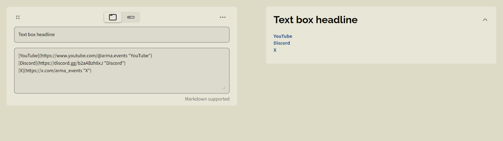

## Images

Format `![ALTERNATIVE TEXT] (URL "MOUSEOVER TEXT")`

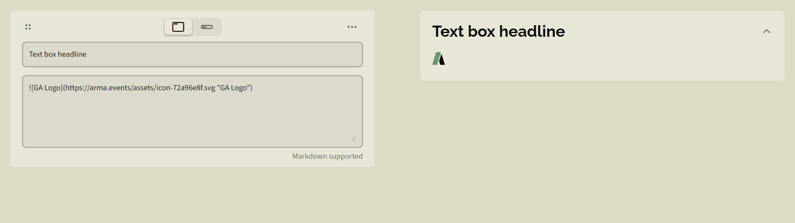

## Autolinks and Email Addresses

Enclose your URL or email address in `<` and `>` to create an automatic link with the URI as the link text.

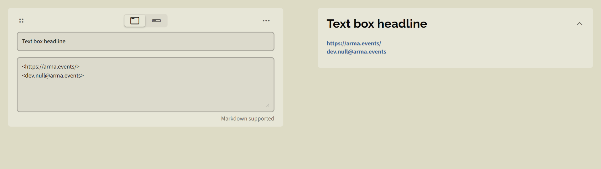

## Code Block (monospaced text)

Beginn every line with ` ` 4 blank spaces to create a code block. Alternatively, enclose the text in ` ``` ` to create a code block. No support for syntax highlighting.

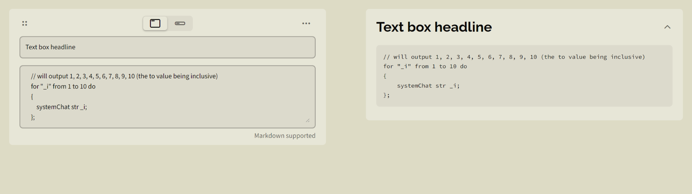

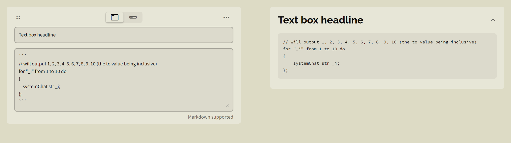

## Blockquote

Beginn every line with `>` and a ` ` blank space to create a blockquote.

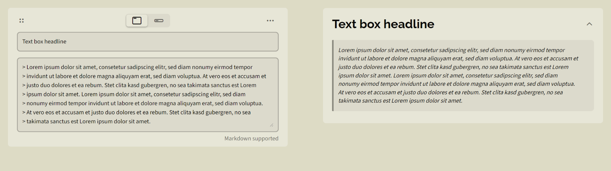

## Alerts

Markdown alerts are created like blockquotes but the first line contains a keyword like `[!NOTE]` or `[!WARNING]`.

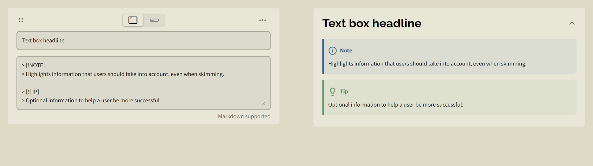

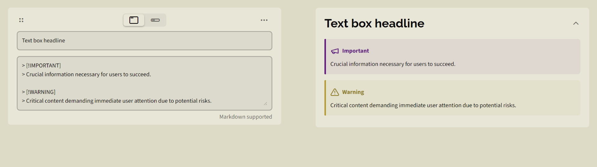

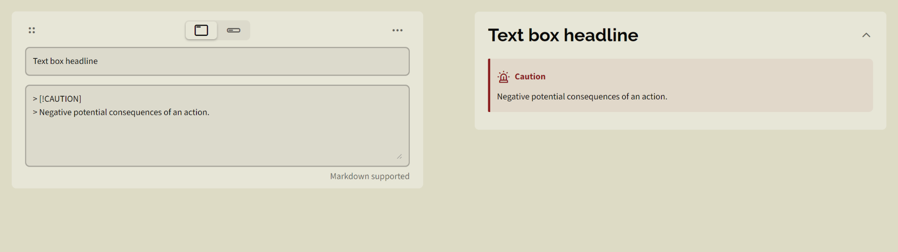

## Escaping Markdown characters

If you want to treat Markdown characters as normal text then you can escape these characters with the `\` prefix.

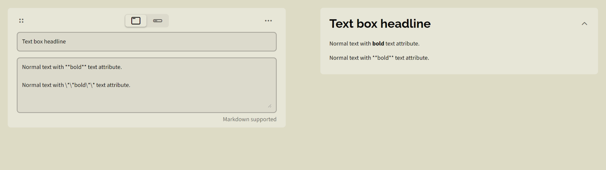
