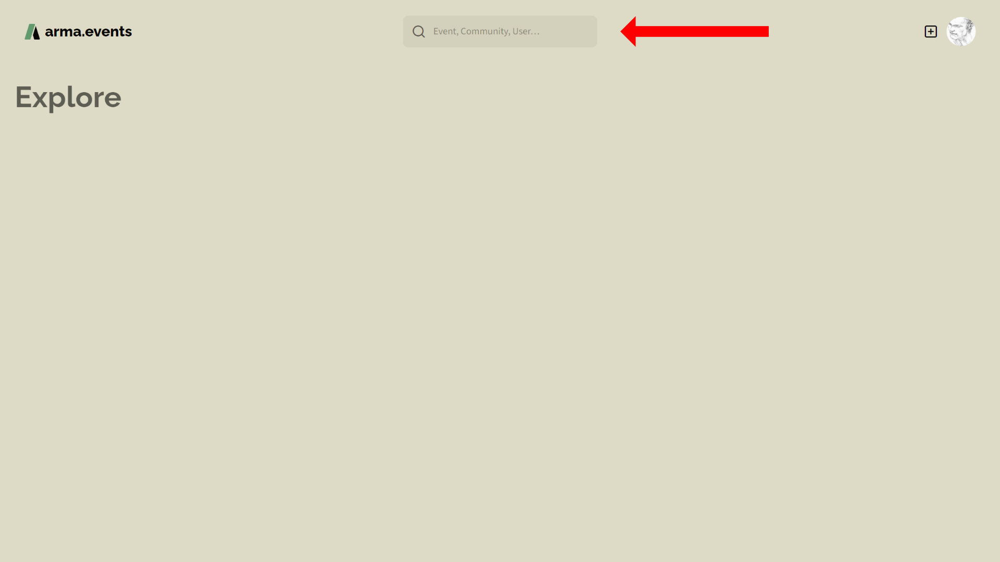
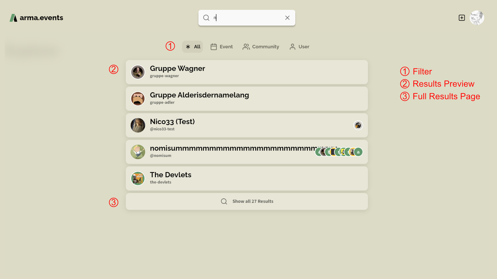
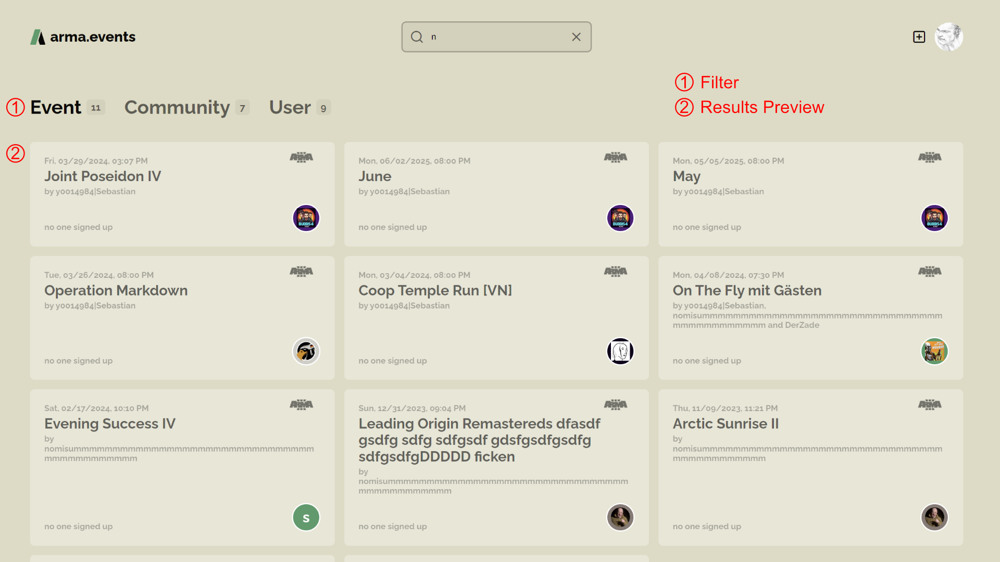
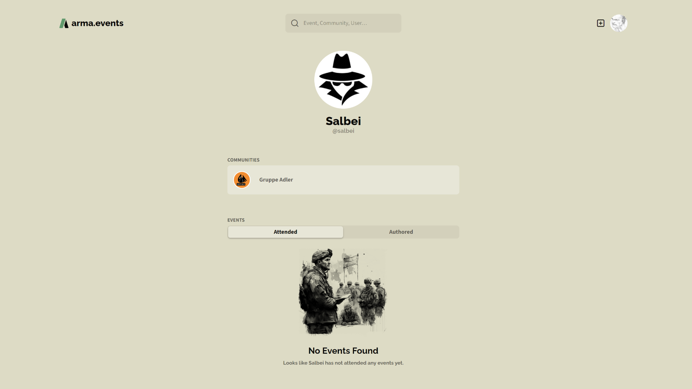
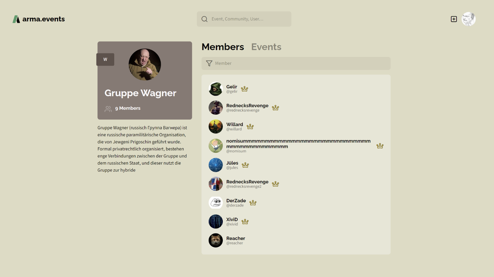
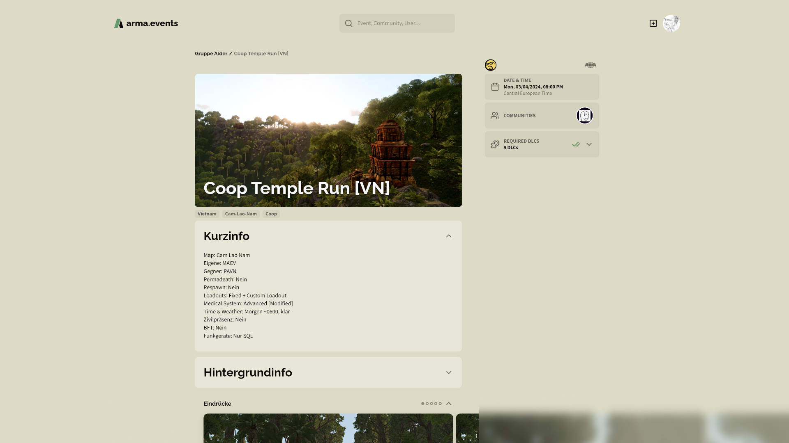

# Overview

## Global Search Bar

Our global search bar is accessible on every page on the very top. There you can search for events, communities and users.

While typing you get quick search results. You can **filter** (1) the results directly, access the **results** (2) or go to the **full results page** (3).

The full search results page gives you access to **all search results** (2) and also allows you to **filter** (1) the results for events, communities or users. The results have a more detailed preview then the quick search results. Click on a result to jump directly to the corresponding page.

## User Profile Pages

Every user has a globally visible profile page containing the avatar, the display name and the handle of the user as well as a list of communities the user is a member of and lists of the events in which the user took part or of which the user was an author. You can directly access the communities or events from these lists. See [users](./users "Users") for more details.

## Community Profile Pages

Every community has a globally visible profile page containing the logo, the name, the tag, the member count and an introduction as well as a searchable list of all members (including avatar, name, handle and a crown if the member is an administrator of this community) and lists of past and upcoming events. You can directly access the users (WIP) or events from these lists. See [communities](./communities "Communities") for more details.

## Event Pages

Every event if not set to private has a globally visible profile page containing the name, the main image, the start date and time, the hosting community and the guest communities, the list of authors, the game and the required DLCs, the tags, the slotlist (WIP) and perhaps multiple text and image boxes containing the event briefing. See [events](./events "Events") for more details.

