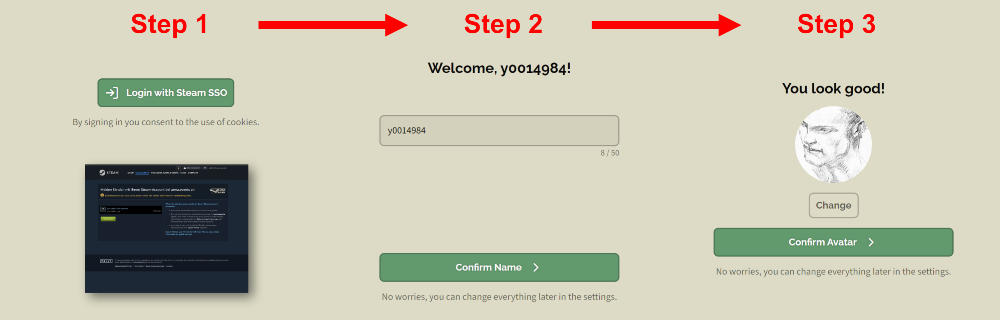
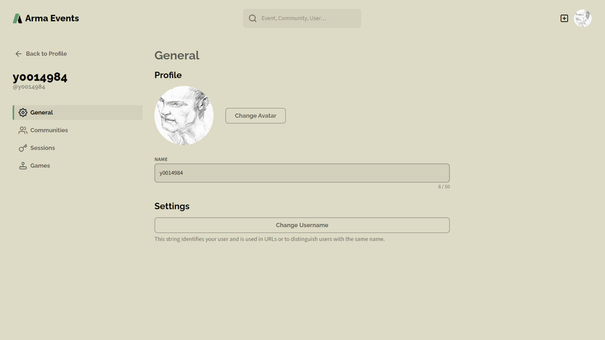
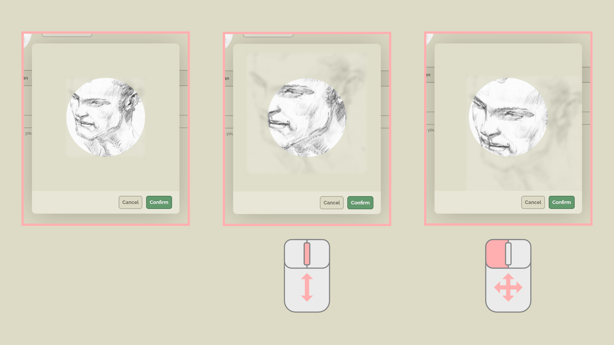
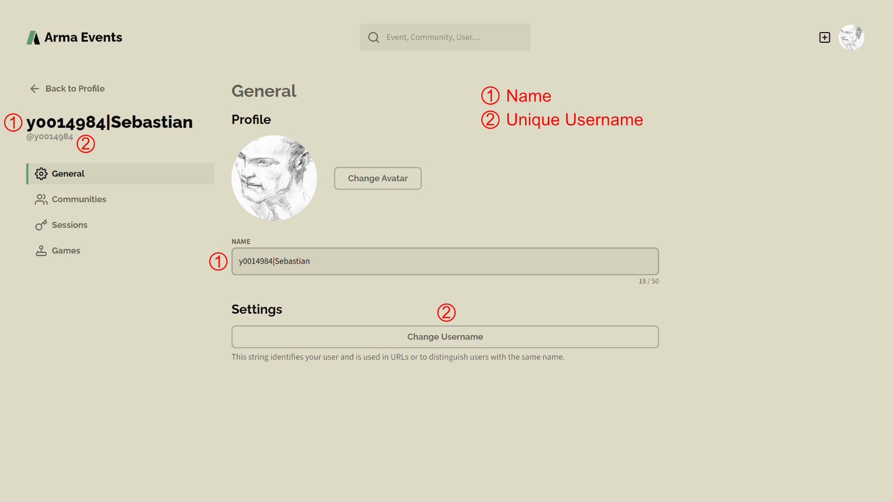
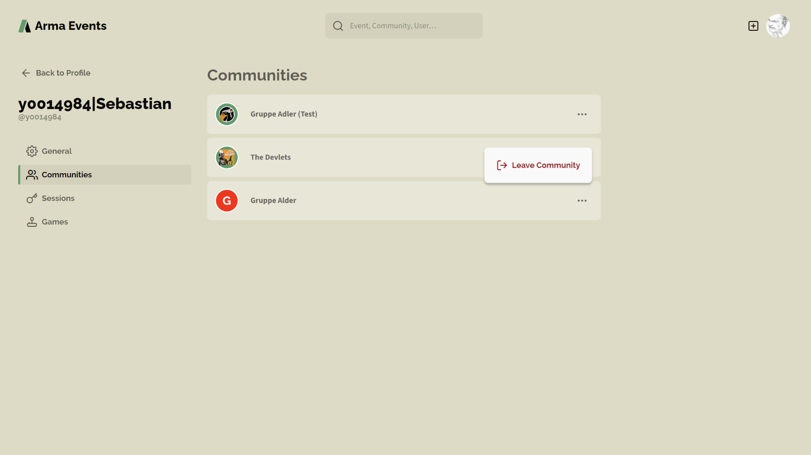
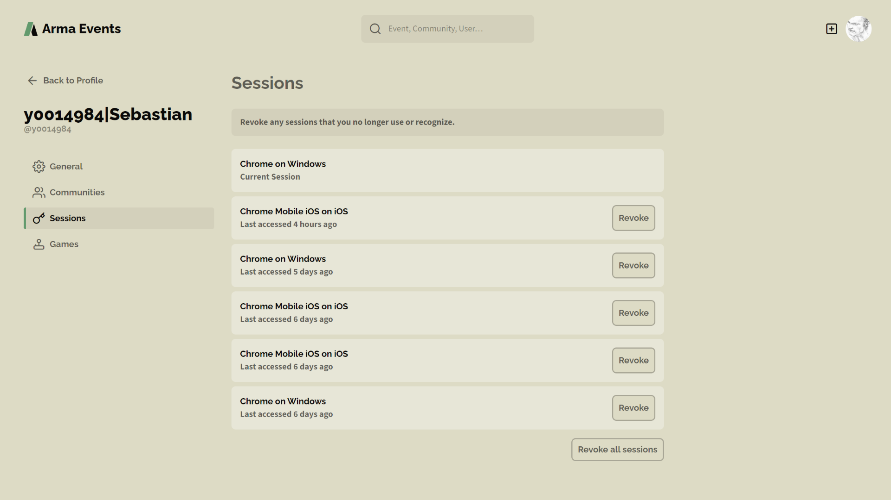
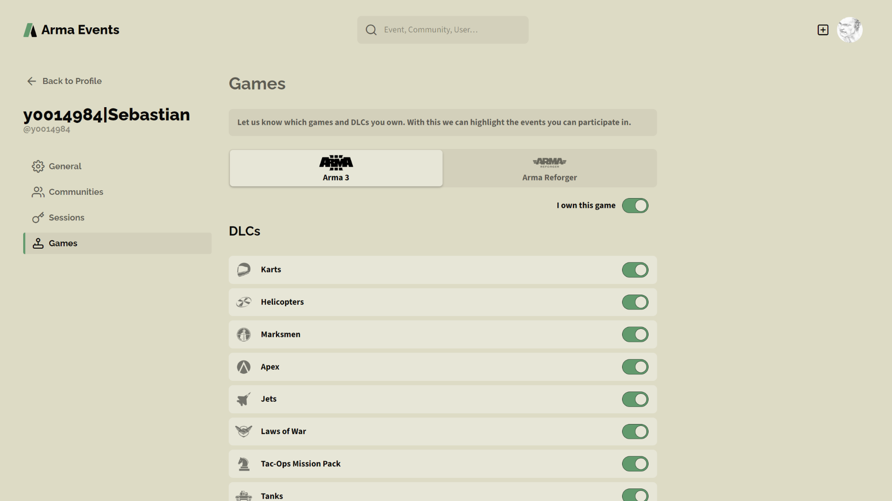

# User

## Login with Steam SSO

It is very likely that every player that wants to use our platform has a Steam account. That is why we decided to link accounts on **arma.events** to the players Steam account. You simply need to login with your Steam account. That's all it takes. There is currently no way to create an account based on email address and password. Steam takes care of the login process for us. We can neither see your passord nor access your steam account.

## Create User Account

It takes only three simple assistant-driven steps to create an **arma.events** user account. First, login with your existing Steam Account. You will be redirected automatically to Steam and back whithin this process. Second, confirm or change your display name. Third, choose your avatar or leave it blank.

That's it. You are now succcessfully logged into arma.events with your Steam account. You can change everything later in your profile settings. Now you can create your own community or ask your community manager to send you an invite to your community. As a member of a community you can join the events of that community. See [Communities](communities.md "Communities") for more information.

## Delete User Account

***WIP***

## Edit User Profile

### Avatar

Various image file formats are supported. You can zoom into your image with the **scroll wheel** of your mouse and move the image while holding your **left mouse button**. The avatar is always displayed in a circle. We store your image with a resolution of 256x256 pixels. Using a very low-res image or zooming in can lead to a blurry image.

### Display Name vs. Handle

The **display name** and the **handle** are identical after first login. But they can be changed later individually.

Set your **display name** to any string that is less or equal 50 unicode characters. The display name is the one that is displayed on **arma.events** most of the time. You can share the same display name with other users.

The **handle** is a string with 32 or less web-safe characters that has to be unique on our platform. The availability of the handle is checked every time you try to change it. The handle is mostly used in URLs. In all other cases the display name is shown.

### Communities

Your user profile contains a list of all communities you are a member of. You can use this overview to quickly jump to the community or the leave the communities you no longer want to be part of by using the 3 dots context menu.

Keep in mind that the community will be deleted if you are the only/last member. If there are other members but you are the only administrator of this community then you need to transfer your admin rights to another member. See [communities](communities.md "Communities") for more information about community management.

### Sessions

Session management is a security feature. It lists every active browser session on your devices. Feel free to close/revoke all sessions you no longer need or all sessions at once. A revoked session means that you need to login again on that specific device/browser combination.

### Games and DLCs

In your profile you can setup which games you own. Currently supported are Arma 3 and Arma Reforger. Contact our [Support](support.md "Support") if you are interested in adding more games. If the game supports DLCs then please specify which DLCs you own.

Your owned DLCs will be matched against the DLC requirements that a mission creator has defined for a specific event. In case of a missing DLC you will get a warning.

